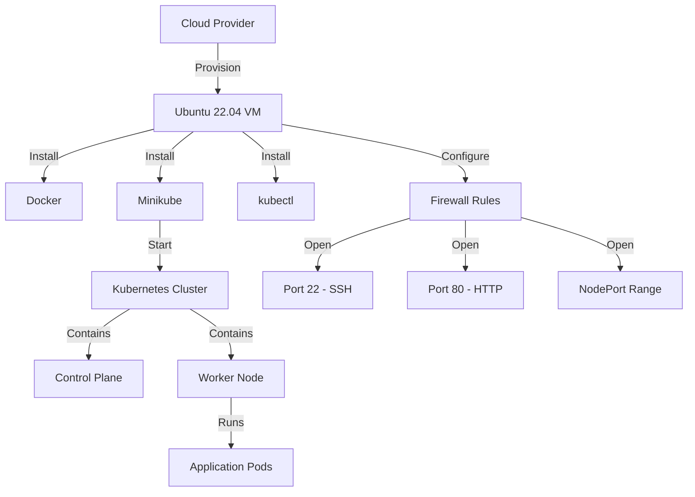
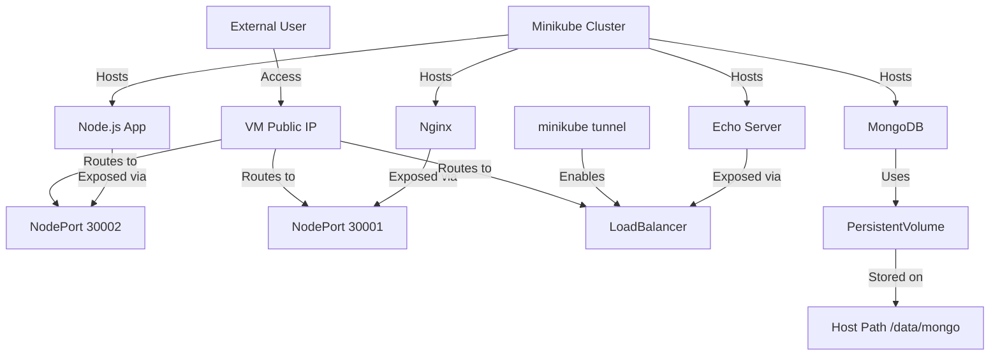

# Day 3: Deploying on a Cloud VM with Minikube

## Table of Contents
- [Day 3: Deploying on a Cloud VM with Minikube](#day-3-deploying-on-a-cloud-vm-with-minikube)
  - [Table of Contents](#table-of-contents)
  - [3.1 Minikube on Cloud VM](#31-minikube-on-cloud-vm)
    - [Minikube Setup on a Cloud Instance (Ubuntu 22.04 LTS)](#minikube-setup-on-a-cloud-instance-ubuntu-2204-lts)
    - [Deploying Applications on Minikube](#deploying-applications-on-minikube)
  - [References](#references)

## 3.1 Minikube on Cloud VM

Now that everything works on Docker Desktop (local), we'll simulate a more production-like environment by setting up Kubernetes on a cloud instance (e.g., an Ubuntu 22.04 VM on AWS or Azure). We'll use Minikube to set up a single-node cluster on that VM. Additionally, we'll practice deploying multiple apps and exposing them with different methods (NodePort, LoadBalancer, Ingress/Reverse Proxy).

### Minikube Setup on a Cloud Instance (Ubuntu 22.04 LTS)

Setting up the VM requires several steps:

1. **Provision a VM on your cloud of choice**
   - Ensure it has at least 2 CPUs and 4GB RAM for smooth operation (more if running multiple apps)
   - Ubuntu 22.04 is the recommended OS
   - Open necessary firewall ports:
     - Port 22 (SSH)
     - Port 80 (to expose our apps via HTTP)
     - NodePort range (30000-32767) or specific NodePorts we plan to use (e.g., 30002) for testing
   - If using an Nginx reverse proxy on port 80, you can funnel traffic through port 80 and avoid exposing high-number ports

2. **Install Docker and Minikube dependencies**
   - SSH into the VM and run the following commands:

   ```bash
   # Update OS
   sudo apt-get update && sudo apt-get upgrade
   
   # Install Docker
   sudo apt-get install -y docker.io
   
   # Ensure the docker service is running
   sudo systemctl status docker
   
   # Add your user to the docker group if you plan to run without sudo
   sudo usermod -aG docker $USER
   ```

3. **Install Minikube**
   - Download and install the binary:

   ```bash
   curl -LO https://storage.googleapis.com/minikube/releases/latest/minikube-linux-amd64
   sudo install minikube-linux-amd64 /usr/local/bin/minikube
   ```

4. **Install kubectl**
   - Download and install the kubectl binary:

   ```bash
   curl -LO "https://storage.googleapis.com/kubernetes-release/release/$(minikube kubectl --version)/bin/linux/amd64/kubectl"
   chmod +x kubectl
   sudo mv kubectl /usr/local/bin/
   ```

5. **Start Minikube**
   - We will use the Docker driver (meaning Minikube will create a single-node Kubernetes that runs in a Docker container on this VM):

   ```bash
   minikube start --driver=docker --memory=4g --cpus=2
   ```

   - Minikube will pull the required images (kicbase image for the node) and set up Kubernetes
   - This can take a few minutes on first start
   - If everything succeeds, you'll get a message that the cluster is running and kubectl is configured to use it

6. **Test the cluster**
   - Verify the node is running:

   ```bash
   kubectl get nodes
   ```

   - It should show one node named "minikube"
   - Check system pods:

   ```bash
   kubectl get pods -A
   ```

   - All pods should be running (like kube-system pods, etc.)



### Deploying Applications on Minikube

We'll deploy three applications to our Minikube cluster:

1. **Sparta Node.js app with MongoDB**
   - We'll reuse our existing manifests with slight modifications if needed
   - Expose via NodePort 30002

2. **Nginx**
   - 3 replicas
   - Expose via NodePort 30001

3. **Echo Server**
   - Simple echo server that returns request details
   - Expose via LoadBalancer service

For the LoadBalancer service, we'll need to use `minikube tunnel` since Minikube doesn't have a cloud provider to provision real load balancers. The tunnel creates a network route on the host to services of type LoadBalancer.

**Networking in Minikube:**
- By default, Minikube on Docker driver will not have a LoadBalancer capability (as there's no cloud)
- NodePort services will be accessible on the VM's IP
- For example, if we expose NodePort 30002, to reach it from outside, we use http://<VM public IP>:30002
- We'll use an Nginx reverse proxy on the host to forward traffic to our NodePort services

**Storage in Minikube:**
- Minikube usually comes with a default StorageClass that provisions hostPath volumes on the VM
- We can reuse our static PV approach for MongoDB, or convert to using a PVC with storageClass
- The path on this Ubuntu VM for hostPath might be different from our local setup
- Our manifest uses `/data/mongo` - we should make sure that path exists and is writable by the container

**Deployment Steps:**

1. Deploy Nginx (Deployment + NodePort Service 30001)
2. Deploy Echo Server (Deployment + LoadBalancer Service)
3. Deploy Node.js/MongoDB (Deployment + PVC/PV + Service NodePort 30002)

For the LoadBalancer service, run `minikube tunnel` in a separate SSH session (so it keeps running). When the echo server service is created, `kubectl get svc echo-service` will initially show `<pending>` in the EXTERNAL-IP column. After starting minikube tunnel, it should update to some IP (like 10.0.2.15). That IP is actually on the VM itself.



## References

[1] Kubernetes.io. "Minikube Documentation." [https://kubernetes.io/docs/setup/learning-environment/minikube/](https://kubernetes.io/docs/setup/learning-environment/minikube/)

[2] Minikube.sigs.k8s.io. "Minikube Handbook." [https://minikube.sigs.k8s.io/docs/handbook/](https://minikube.sigs.k8s.io/docs/handbook/)

[3] Kubernetes.io. "Service Types." [https://kubernetes.io/docs/concepts/services-networking/service/#publishing-services-service-types](https://kubernetes.io/docs/concepts/services-networking/service/#publishing-services-service-types)
