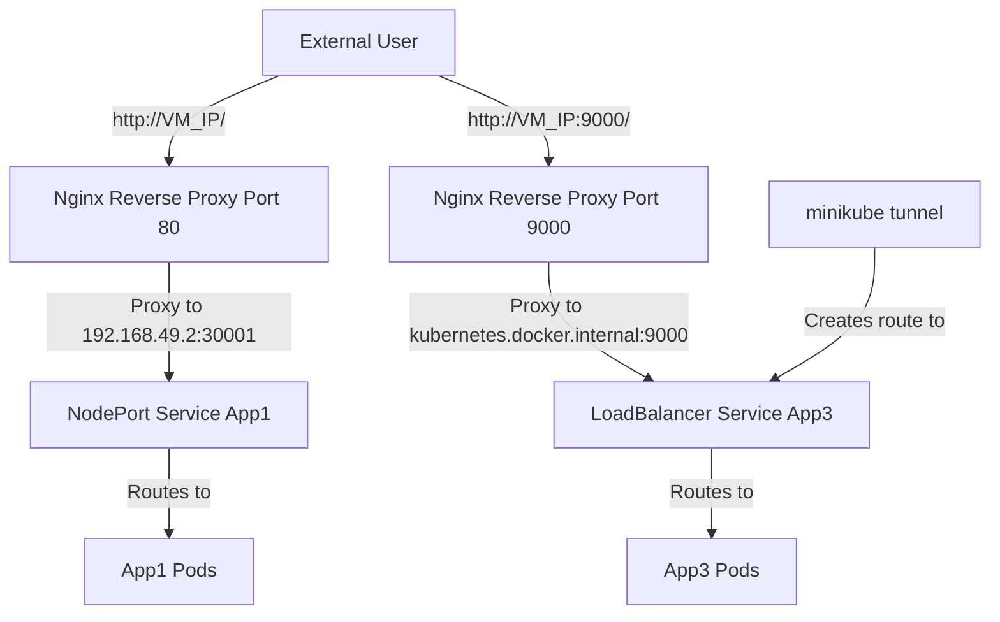

# Day 3: Advanced Networking

## Table of Contents
- [Day 3: Advanced Networking](#day-3-advanced-networking)
  - [Table of Contents](#table-of-contents)
  - [3.2 Advanced Networking](#32-advanced-networking)
    - [Configuring Nginx Reverse Proxy](#configuring-nginx-reverse-proxy)
    - [Testing the Setup](#testing-the-setup)
    - [Minikube Networking Concepts](#minikube-networking-concepts)
    - [Cleanup and Management](#cleanup-and-management)
  - [References](#references)

## 3.2 Advanced Networking

Now that we have our applications deployed on Minikube, we need to configure an Nginx reverse proxy on the VM to route external traffic to our services. This approach allows us to expose multiple applications through different entry points.

### Configuring Nginx Reverse Proxy

We have two applications to expose:
- App1 on NodePort 30001
- App3 (echoserver) on port 9000 via LoadBalancer

We will configure Nginx (on the host VM, not the one in cluster) to listen on different ports:
- `http://<VM IP>/` → forwards to 192.168.49.2:30001 (the NodePort of App1)
- `http://<VM IP>:9000/` → forwards to kubernetes.docker.internal:9000 (the LoadBalancer service for App3)

For the App3 service, we'll use the LoadBalancer IP assigned by Minikube tunnel. After running `minikube tunnel`, the LoadBalancer service becomes accessible, so Nginx on the host can proxy to that IP.

**Steps to configure Nginx reverse proxy:**

1. **Install Nginx on the Ubuntu VM**

```bash
sudo apt-get install -y nginx
```

Nginx will likely start automatically listening on port 80.

2. **Configure Nginx**

Create a configuration file:

```bash
sudo nano /etc/nginx/sites-available/default
```

Replace the content with:

```nginx
server {
    listen 80;
    server_name _;

    location / {
        proxy_pass http://192.168.49.2:30001;
        proxy_set_header Host $host;
        proxy_set_header X-Real-IP $remote_addr;
        proxy_set_header X-Forwarded-For $proxy_add_x_forwarded_for;
        proxy_set_header X-Forwarded-Proto $scheme;
    }
}

server {
    listen 9000;
    server_name _;

    location / {
        # The proxy pass IP will be the external IP
        # This will only work when minikube tunnel is running
        proxy_pass http://kubernetes.docker.internal:9000;
        proxy_set_header Host $host;
        proxy_set_header X-Real-IP $remote_addr;
        proxy_set_header X-Forwarded-For $proxy_add_x_forwarded_for;
        proxy_set_header X-Forwarded-Proto $scheme;
    }
}
```

This configuration:
- Routes all requests on port 80 to the App1 service running on NodePort 30001
- Routes all requests on port 9000 to the App3 service via the LoadBalancer IP
- The `kubernetes.docker.internal` hostname is used to access the Kubernetes cluster from the host when using Docker Desktop

3. **Test and apply the Nginx configuration**

```bash
# Test the configuration
sudo nginx -t

# If the test passes, restart Nginx to apply changes
sudo systemctl restart nginx
```



### Testing the Setup

From your local machine, you can now access the applications using the VM's public IP:

- `http://<VM_PUBLIC_IP>/` → should reach App1
- `http://<VM_PUBLIC_IP>:9000/` → should hit the App3 echoserver and return request details

This setup allows you to access both applications through different ports on the same VM.

### Minikube Networking Concepts

Important points to understand about Minikube networking:

1. **NodePort Services**
   - A NodePort service is accessible via `NodeIP:NodePort`
   - In our VM, the NodeIP is typically 192.168.49.2 (Minikube's default VM IP)
   - NodePort services are always accessible regardless of whether minikube tunnel is running

2. **LoadBalancer Services with minikube tunnel**
   - Minikube allocates a pseudo-external IP and routes traffic from host to service
   - This simulates cloud LoadBalancers
   - The tunnel must run constantly for the IP to work
   - Run with `minikube tunnel` to enable LoadBalancer services

3. **Nginx as a Gateway**
   - We use Nginx to route traffic to different services
   - Port 80 routes to App1 (NodePort service)
   - Port 9000 routes to App3 (LoadBalancer service)
   - This allows for accessing multiple services through different ports

### Cleanup and Management

When you're done with your Minikube cluster, you can:

1. **Stop the cluster**
   ```bash
   minikube stop
   ```

2. **Configure Minikube to start on boot**

   Create a systemd unit file:
   ```bash
   sudo nano /etc/systemd/system/minikube.service
   ```

   Add the following content:
   ```ini
   [Unit]
   Description=Minikube
   After=docker.service
   Requires=docker.service

   [Service]
   User=root
   ExecStart=/usr/local/bin/minikube start --driver=docker
   ExecStop=/usr/local/bin/minikube stop
   RemainAfterExit=yes

   [Install]
   WantedBy=multi-user.target
   ```

   Enable the service to start on boot:
   ```bash
   sudo systemctl enable minikube.service
   ```

   This will try to start Minikube on boot. Make sure Docker is up before it runs (we specified `After=` and `Requires=docker.service`).

3. **Configure minikube tunnel to start on boot**

   Create another systemd unit file:
   ```bash
   sudo nano /etc/systemd/system/minikube-tunnel.service
   ```

   Add the following content:
   ```ini
   [Unit]
   Description=Minikube Tunnel
   After=minikube.service
   Requires=minikube.service

   [Service]
   User=root
   ExecStart=/usr/local/bin/minikube tunnel
   Restart=always
   RestartSec=3

   [Install]
   WantedBy=multi-user.target
   ```

   Enable the service:
   ```bash
   sudo systemctl enable minikube-tunnel.service
   ```

   This ensures that the tunnel starts after Minikube and restarts if it fails.

4. **Test the auto-start configuration**
   
   Reboot the VM and verify that Minikube and the tunnel start automatically:
   ```bash
   sudo reboot
   ```

   After the VM comes back up, check if Minikube is running:
   ```bash
   kubectl get nodes
   ```

   And check if LoadBalancer services have external IPs:
   ```bash
   kubectl get svc -o wide
   ```

With everything running, we've successfully deployed our applications in the cloud:
- App1 accessible via port 80
- App3 (echoserver) accessible via port 9000
- Both services properly configured with Nginx reverse proxy
- Automatic startup of Minikube and tunnel on system boot

## References

[1] Kubernetes.io. "Service Types." [https://kubernetes.io/docs/concepts/services-networking/service/#publishing-services-service-types](https://kubernetes.io/docs/concepts/services-networking/service/#publishing-services-service-types)

[2] Nginx.org. "Nginx Reverse Proxy." [https://docs.nginx.com/nginx/admin-guide/web-server/reverse-proxy/](https://docs.nginx.com/nginx/admin-guide/web-server/reverse-proxy/)

[3] Minikube.sigs.k8s.io. "Minikube Tunnel." [https://minikube.sigs.k8s.io/docs/handbook/accessing/#loadbalancer-access](https://minikube.sigs.k8s.io/docs/handbook/accessing/#loadbalancer-access)

[4] Systemd.io. "Systemd Service Files." [https://www.freedesktop.org/software/systemd/man/systemd.service.html](https://www.freedesktop.org/software/systemd/man/systemd.service.html)
