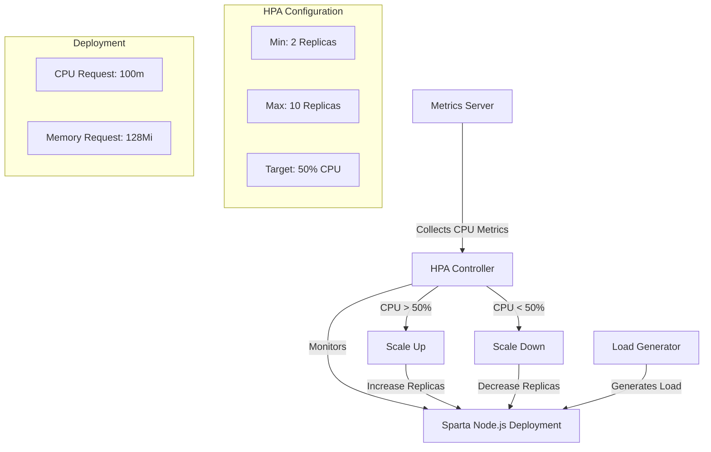
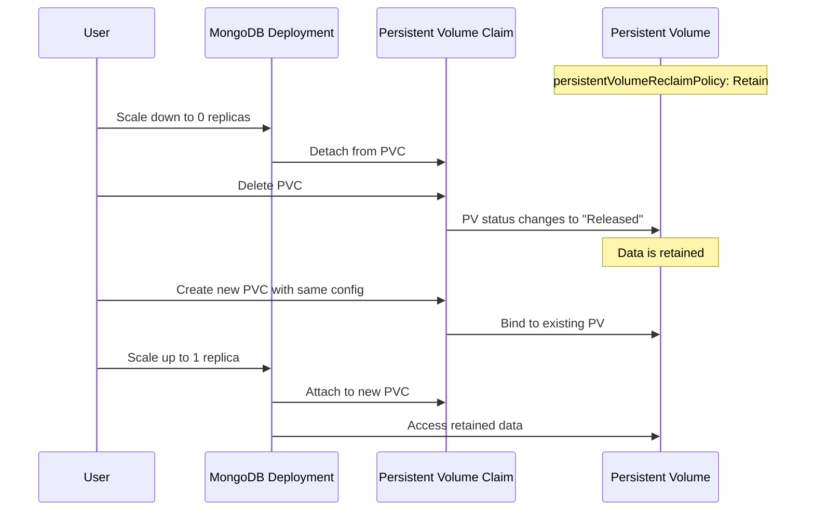
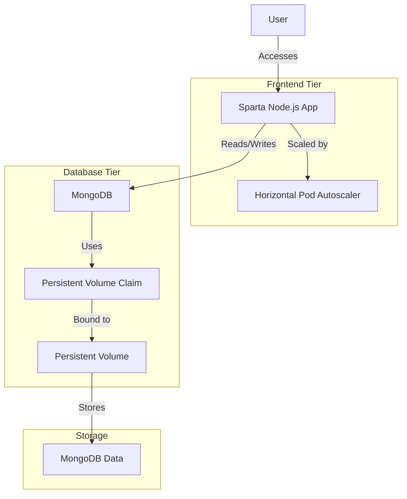

# Kubernetes HPA and PV/PVC Management Diagrams

## Horizontal Pod Autoscaler (HPA) Flow

## PV/PVC Management Flow

## System Architecture

These diagrams illustrate the key components and flows of the Horizontal Pod Autoscaler (HPA) and Persistent Volume (PV) management implementations.
