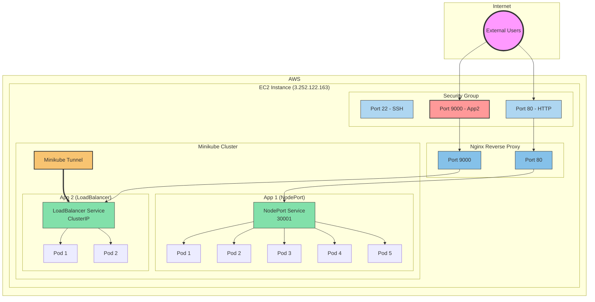

# Multi-App Kubernetes Deployment with Nginx Reverse Proxy

## Overview
This project demonstrates how to deploy multiple applications on a Kubernetes cluster (minikube) and expose them to the internet using an Nginx reverse proxy. The setup showcases different Kubernetes service types and scaling configurations.

## Why This Matters
Understanding how to deploy and manage multiple applications in Kubernetes is crucial for modern cloud-native applications. This project teaches several important concepts:
- Different types of Kubernetes services (NodePort vs LoadBalancer)
- Managing multiple replicas for high availability
- Using Nginx as a reverse proxy to route traffic
- Exposing Kubernetes services to the internet
- Troubleshooting common deployment issues

## Architecture
Here's a visual representation of our setup:



## Components Explained

### 1. First Application (App 1)
- **Deployment**: 5 replicas of `daraymonsta/nginx-257:dreamteam`
- **Service Type**: NodePort (30001)
- **Access**: Through Nginx reverse proxy on port 80
- **Purpose**: Demonstrates basic scaling with multiple replicas

### 2. Second Application (App 2)
- **Deployment**: 2 replicas of `daraymonsta/tech201-nginx-auto:v1`
- **Service Type**: LoadBalancer with NodePort 30002
- **Access**: Through Nginx reverse proxy on port 9000, using ClusterIP (only accessible when minikube tunnel is running)
- **Purpose**: Shows LoadBalancer service type with minikube tunnel

### 3. Nginx Reverse Proxy
- **Role**: Routes external traffic to Kubernetes services
- **Configuration**: 
  - Port 80 → App 1 (NodePort 30001)
  - Port 9000 → App 2 (LoadBalancer ClusterIP)
- **Purpose**: Provides a single entry point for multiple services

### 4. Minikube Tunnel
- **Role**: Enables LoadBalancer functionality in minikube
- **Purpose**: Required for App2 to be accessible (when tunnel stops, App2 becomes inaccessible)

### 5. AWS Security Group
- **Role**: Controls inbound and outbound traffic to the EC2 instance
- **Configuration**:
  - Port 22 (SSH): For administrative access
  - Port 80 (HTTP): For App 1 access
  - Port 9000: For App 2 access (must be explicitly allowed)

## How It Works
1. External users access the applications through the EC2 instance's public IP
2. Traffic passes through the AWS security group (which must allow the relevant ports)
3. Nginx reverse proxy receives the traffic and routes it based on the port:
   - Port 80 requests go to App 1 (NodePort 30001)
   - Port 9000 requests go to App 2 (LoadBalancer ClusterIP)
4. The Kubernetes services distribute traffic to their respective pods
5. The pods process the requests and return responses

## Benefits of This Architecture
1. **Scalability**: Each app can be scaled independently
2. **Isolation**: Apps run in separate pods with their own resources
3. **High Availability**: Multiple replicas ensure service continuity
4. **Simple Access**: Single entry point through Nginx reverse proxy
5. **Flexibility**: Different service types for different needs
6. **Controlled Access**: App2 is only accessible when the minikube tunnel is running

## Common Issues and Solutions

### 1. Incorrect Nginx Configuration
**Issue**: Using localhost (127.0.0.1) instead of the Minikube IP in the Nginx configuration.

**Symptoms**:
- 502 Bad Gateway errors
- Connection refused errors

**Solution**:
- Use the Minikube IP (typically 192.168.49.2) in the Nginx configuration
- Verify the Minikube IP with `minikube ip` command
- Use the correct configuration file (nginx-config-fixed)

### 2. Missing Security Group Rules
**Issue**: AWS security group not allowing traffic on port 9000.

**Symptoms**:
- App 1 works (port 80) but App 2 doesn't (port 9000)
- Connection timeouts when accessing port 9000

**Solution**:
- Add an inbound rule to the security group for port 9000
- Allow traffic from your IP or 0.0.0.0/0 (anywhere)

### 3. Minikube Not Running
**Issue**: Attempting to deploy to a Minikube cluster that isn't running.

**Symptoms**:
- Kubernetes API server connection errors
- Failed deployments

**Solution**:
- Check Minikube status with `minikube status`
- Start Minikube if it's not running with `minikube start`
- Add a check in the deployment script to verify Minikube is running

### 4. Minikube Tunnel Not Running
**Issue**: LoadBalancer services remain in pending state without the tunnel.

**Symptoms**:
- LoadBalancer services show `<pending>` for EXTERNAL-IP
- App 2 is not accessible

**Solution**:
- Start the Minikube tunnel with `minikube tunnel`
- Run it in the background with `nohup minikube tunnel > /dev/null 2>&1 &`
- Verify it's running with `ps aux | grep minikube`

## Step-by-Step Implementation Guide

### Prerequisites
- An EC2 instance running Ubuntu (in our case at 3.252.122.163)
- Minikube installed on the EC2 instance
- kubectl installed on the EC2 instance
- Docker installed on the EC2 instance
- Proper security group configuration (ports 22, 80, and 9000 open)

### 1. Initial Setup and Verification
```bash
# SSH into the EC2 instance
ssh ubuntu@3.252.122.163

# Verify minikube is running
minikube status

# Expected output:
# type: Control Plane
# host: Running
# kubelet: Running
# apiserver: Running
# kubeconfig: Configured

# If minikube is not running, start it
minikube start

# Get the minikube IP (important for nginx configuration)
minikube ip

# Expected output:
# 192.168.49.2
```

### 2. Setting Up App 1 (NodePort Service)

#### Create the Deployment File (app1-deploy.yml)
```yaml
apiVersion: apps/v1
kind: Deployment
metadata:
  name: app1-deployment
  labels:
    app: app1
spec:
  replicas: 5  # We want 5 identical pods
  selector:
    matchLabels:
      app: app1
  template:
    metadata:
      labels:
        app: app1
    spec:
      containers:
      - name: nginx
        image: daraymonsta/nginx-257:dreamteam
        ports:
        - containerPort: 80  # Container exposes port 80
```

**Explanation:**
- `replicas: 5`: Creates 5 identical pods for high availability
- `matchLabels`: Links the deployment to pods with matching labels
- `containerPort: 80`: The port that the nginx container listens on

#### Create the Service File (app1-service.yml)
```yaml
apiVersion: v1
kind: Service
metadata:
  name: app1-service
spec:
  type: NodePort
  selector:
    app: app1
  ports:
    - port: 80        # Port exposed by the service
      targetPort: 80  # Port on the pods to forward to
      nodePort: 30001 # External port on the node
```

**Explanation:**
- `type: NodePort`: Makes the service accessible on a static port on each node
- `port: 80`: The port this service will be available on within the cluster
- `targetPort: 80`: The port on the pods where traffic will be sent
- `nodePort: 30001`: The external port where the service will be accessible

### 3. Setting Up App 2 (LoadBalancer Service)

#### Create the Deployment File (app2-deploy.yml)
```yaml
apiVersion: apps/v1
kind: Deployment
metadata:
  name: app2-deployment
  labels:
    app: app2
spec:
  replicas: 2  # We want 2 identical pods
  selector:
    matchLabels:
      app: app2
  template:
    metadata:
      labels:
        app: app2
    spec:
      containers:
      - name: nginx
        image: daraymonsta/tech201-nginx-auto:v1
        ports:
        - containerPort: 80
```

**Explanation:**
- Similar to App 1's deployment but with 2 replicas
- Uses a different image: daraymonsta/tech201-nginx-auto:v1

#### Create the Service File (app2-service.yml)
```yaml
apiVersion: v1
kind: Service
metadata:
  name: app2-service
spec:
  type: LoadBalancer
  selector:
    app: app2
  ports:
    - port: 9000      # Port exposed by the LoadBalancer
      targetPort: 80  # Port on the pods
      nodePort: 30002 # Fallback port on the node
```

**Explanation:**
- `type: LoadBalancer`: Requests a load balancer from the cloud provider
- `port: 9000`: The port this service will be available on
- `targetPort: 80`: The port on the pods where traffic will be sent
- `nodePort: 30002`: Backup port if LoadBalancer isn't available

### 4. Setting Up Nginx Reverse Proxy

#### Create Nginx Configuration Template (nginx-config-lb)
```nginx
server {
    listen 80;
    server_name _;

    location / {
        proxy_pass http://192.168.49.2:30001;  # Minikube IP and NodePort
        proxy_set_header Host $host;
        proxy_set_header X-Real-IP $remote_addr;
        proxy_set_header X-Forwarded-For $proxy_add_x_forwarded_for;
        proxy_set_header X-Forwarded-Proto $scheme;
    }
}

server {
    listen 9000;
    server_name _;

    location / {
        # This will be replaced with the LoadBalancer's ClusterIP and port by the deploy script
        proxy_pass http://LOADBALANCER_IP:9000;
        proxy_set_header Host $host;
        proxy_set_header X-Real-IP $remote_addr;
        proxy_set_header X-Forwarded-For $proxy_add_x_forwarded_for;
        proxy_set_header X-Forwarded-Proto $scheme;
    }
}
```

**Explanation:**
- Two server blocks: one for each app
- App 1 uses the NodePort directly (192.168.49.2:30001)
- App 2 uses a placeholder (LOADBALANCER_IP) that will be replaced with the actual ClusterIP
- This ensures App 2 is only accessible when the minikube tunnel is running

### 5. AWS Security Group Configuration

1. Log in to the AWS Management Console
2. Navigate to EC2 > Security Groups
3. Select the security group attached to your EC2 instance
4. Click "Edit inbound rules"
5. Ensure you have the following rules:
   - Type: SSH, Port: 22, Source: Your IP or 0.0.0.0/0
   - Type: HTTP, Port: 80, Source: 0.0.0.0/0
   - Type: Custom TCP, Port: 9000, Source: 0.0.0.0/0
6. Save rules

### 6. Deployment Script (deploy.sh)

Create a deployment script to automate the process:

```bash
#!/bin/bash

# First, check if Minikube is running on the VM
echo "Checking if Minikube is running on the VM..."
MINIKUBE_STATUS=$(ssh ubuntu@3.252.122.163 "minikube status | grep -c 'host: Running'")

if [ "$MINIKUBE_STATUS" -ne 1 ]; then
    echo "Error: Minikube is not running on the VM. Please start it first."
    echo "You can start it by running: ssh ubuntu@3.252.122.163 'minikube start'"
    exit 1
fi

echo "Minikube is running. Proceeding with deployment..."

# Create directories on the VM
ssh ubuntu@3.252.122.163 "mkdir -p ~/app1 ~/app2"

# Copy files to the VM
scp app1/app1-deploy.yml app1/app1-service.yml ubuntu@3.252.122.163:~/app1/
scp app2/app2-deploy.yml app2/app2-service.yml ubuntu@3.252.122.163:~/app2/
scp nginx-config-lb ubuntu@3.252.122.163:~/nginx-config-lb

# Deploy the apps on the VM
ssh ubuntu@3.252.122.163 "
# Apply the Kubernetes manifests
kubectl apply -f ~/app1/app1-deploy.yml
kubectl apply -f ~/app1/app1-service.yml
kubectl apply -f ~/app2/app2-deploy.yml
kubectl apply -f ~/app2/app2-service.yml

# Start minikube tunnel in the background
echo 'Starting minikube tunnel...'
pkill -f 'minikube tunnel' || true
nohup minikube tunnel > /dev/null 2>&1 &

# Wait for LoadBalancer to get an external IP
echo 'Waiting for LoadBalancer to get an external IP...'
ATTEMPTS=0
MAX_ATTEMPTS=30
LOADBALANCER_IP=''

while [ \$ATTEMPTS -lt \$MAX_ATTEMPTS ]; do
    LOADBALANCER_IP=\$(kubectl get service app2-service -o jsonpath='{.status.loadBalancer.ingress[0].ip}')
    if [ -n \"\$LOADBALANCER_IP\" ]; then
        echo \"LoadBalancer IP: \$LOADBALANCER_IP\"
        break
    fi
    ATTEMPTS=\$((ATTEMPTS+1))
    echo \"Attempt \$ATTEMPTS/\$MAX_ATTEMPTS: Waiting for LoadBalancer IP...\"
    sleep 2
done

if [ -z \"\$LOADBALANCER_IP\" ]; then
    echo \"Error: Failed to get LoadBalancer IP after \$MAX_ATTEMPTS attempts.\"
    exit 1
fi

# Get the ClusterIP of the LoadBalancer service
CLUSTER_IP=\$(kubectl get service app2-service -o jsonpath='{.spec.clusterIP}')
echo \"App2 service ClusterIP: \$CLUSTER_IP\"

# Replace the placeholder in the nginx config with the actual ClusterIP
sed -i \"s/LOADBALANCER_IP/\$CLUSTER_IP/g\" ~/nginx-config-lb

# Install nginx if not already installed
if ! command -v nginx &> /dev/null; then
    sudo apt-get update
    sudo apt-get install -y nginx
fi

# Configure nginx
sudo cp ~/nginx-config-lb /etc/nginx/sites-available/default
echo \"Testing nginx configuration...\"
sudo nginx -t && sudo systemctl restart nginx

# Check the status of the deployments
kubectl get deployments
kubectl get services
"
```

**Key Changes in the Deployment Script:**
1. Uses `nginx-config-lb` instead of `nginx-config-fixed`
2. Kills any existing minikube tunnel processes before starting a new one
3. Waits for the LoadBalancer to get an external IP (indicating the tunnel is working)
4. Gets the ClusterIP of the App2 service
5. Replaces the placeholder in the nginx config with the actual ClusterIP
6. This ensures App2 is only accessible when the minikube tunnel is running

Make the script executable:
```bash
chmod +x deploy.sh
```

### 7. Deployment Steps

Run the deployment script:
```bash
./deploy.sh
```

Expected output:
```
Checking if Minikube is running on the VM...
Minikube is running. Proceeding with deployment...
app1-deploy.yml                                                                                                                100%  356    17.1KB/s   00:00    
app1-service.yml                                                                                                               100%  176     8.5KB/s   00:00    
app2-deploy.yml                                                                                                                100%  358    16.7KB/s   00:00    
app2-service.yml                                                                                                               100%  182     8.4KB/s   00:00    
nginx-config-lb                                                                                                                100%  647    32.2KB/s   00:00    
deployment.apps/app1-deployment unchanged
service/app1-service unchanged
deployment.apps/app2-deployment unchanged
service/app2-service unchanged
Starting minikube tunnel...
Waiting for LoadBalancer to get an external IP...
Attempt 1/30: Waiting for LoadBalancer IP...
LoadBalancer IP: 10.106.136.63
App2 service ClusterIP: 10.106.136.63
Testing nginx configuration...
nginx: the configuration file /etc/nginx/nginx.conf syntax is ok
nginx: configuration file /etc/nginx/nginx.conf test is successful
NAME              READY   UP-TO-DATE   AVAILABLE   AGE
app1-deployment   5/5     5            5           10m
app2-deployment   2/2     2            2           10m
NAME           TYPE           CLUSTER-IP      EXTERNAL-IP     PORT(S)          AGE
app1-service   NodePort       10.97.156.66    <none>          80:30001/TCP     10m
app2-service   LoadBalancer   10.106.136.63   10.106.136.63   9000:30002/TCP   10m
kubernetes     ClusterIP      10.96.0.1       <none>          443/TCP          44m
```

### 8. Testing the Setup

```bash
# Test App 1 (default nginx page)
curl http://3.252.122.163/

# Expected output:
# <!DOCTYPE html>
# <html>
# <head>
# <title>Welcome to nginx!</title>
# ...
# <h1>Welcome to the tech 257 dream team!</h1>
# ...
# </html>

# Test App 2 (Ramon's wonderland)
curl http://3.252.122.163:9000/

# This should work only when the minikube tunnel is running
```

### 9. Verification Steps

After deployment, verify that everything is working correctly:

```bash
# Check if minikube is running
ssh ubuntu@3.252.122.163 "minikube status"

# Check if minikube tunnel is running
ssh ubuntu@3.252.122.163 "ps aux | grep minikube"

# Check if nginx is running
ssh ubuntu@3.252.122.163 "sudo systemctl status nginx"

# Check the deployments
ssh ubuntu@3.252.122.163 "kubectl get deployments"

# Check the services
ssh ubuntu@3.252.122.163 "kubectl get services"
```

### 10. Testing Tunnel Dependency

To verify that App2 is only accessible when the minikube tunnel is running:

```bash
# First, test that App2 is accessible
curl http://3.252.122.163:9000/

# Stop the minikube tunnel
ssh ubuntu@3.252.122.163 "pkill -f 'minikube tunnel'"

# Wait a few seconds for the connection to close
sleep 5

# Try to access App2 again - it should fail
curl http://3.252.122.163:9000/

# Restart the tunnel
ssh ubuntu@3.252.122.163 "nohup minikube tunnel > /dev/null 2>&1 &"

# Wait for the LoadBalancer to get an external IP
sleep 10

# Try to access App2 again - it should work now
curl http://3.252.122.163:9000/
```

## Why App2 Requires the Minikube Tunnel

In our updated configuration, App2 is only accessible when the minikube tunnel is running because:

1. **ClusterIP vs NodePort**: 
   - The original configuration used the NodePort (30002) directly, which is always accessible regardless of the tunnel
   - The new configuration uses the service's ClusterIP, which is only routable when the tunnel is running

2. **How Minikube Tunnel Works**:
   - Minikube tunnel creates a network route between your host and the Kubernetes cluster
   - It makes LoadBalancer services accessible by assigning them an external IP
   - When the tunnel stops, these routes are removed, making the LoadBalancer services inaccessible

3. **Nginx Configuration**:
   - The nginx configuration now points to the ClusterIP of the LoadBalancer service
   - This ClusterIP is only routable when the tunnel is running
   - When the tunnel stops, nginx can't reach the service, making App2 inaccessible

This setup demonstrates a key Kubernetes concept: the difference between NodePort and LoadBalancer service types, and how they interact with network routing in a local development environment.

## Troubleshooting Guide

### Issue 1: App 1 works but App 2 doesn't

**Diagnosis**:
1. Check if port 9000 is open in the AWS security group
2. Verify the nginx configuration is using the correct ClusterIP
3. Confirm the minikube tunnel is running

**Commands**:
```bash
# Check security group rules in AWS console

# Verify nginx configuration
ssh ubuntu@3.252.122.163 "cat /etc/nginx/sites-available/default"

# Check if minikube tunnel is running
ssh ubuntu@3.252.122.163 "ps aux | grep minikube"

# Check the LoadBalancer service status
ssh ubuntu@3.252.122.163 "kubectl get service app2-service"
```

### Issue 2: 502 Bad Gateway

**Diagnosis**:
1. Check if the pods are running
2. Verify the nginx configuration
3. Check if the services are properly exposed
4. Verify the minikube tunnel is running

**Commands**:
```bash
# Check pod status
ssh ubuntu@3.252.122.163 "kubectl get pods"

# Check pod logs
ssh ubuntu@3.252.122.163 "kubectl logs <pod-name>"

# Check service endpoints
ssh ubuntu@3.252.122.163 "kubectl get endpoints"

# Test nginx configuration
ssh ubuntu@3.252.122.163 "sudo nginx -t"

# Check if minikube tunnel is running
ssh ubuntu@3.252.122.163 "ps aux | grep minikube"
```

### Issue 3: LoadBalancer service shows `<pending>`

**Diagnosis**:
1. Check if minikube tunnel is running
2. Verify minikube status

**Commands**:
```bash
# Start minikube tunnel
ssh ubuntu@3.252.122.163 "nohup minikube tunnel > /dev/null 2>&1 &"

# Check service status
ssh ubuntu@3.252.122.163 "kubectl get services"
```

## Lessons Learned

1. **Always verify prerequisites**: Check if Minikube is running before attempting to deploy.

2. **Use the correct IP addresses**: Use the Minikube IP (192.168.49.2) for NodePort services and ClusterIP for LoadBalancer services.

3. **Configure security properly**: Ensure all required ports are open in the AWS security group.

4. **Verify each component**: Test each part of the system independently to isolate issues.

5. **Automate with checks**: Include verification steps in your deployment scripts to catch issues early.

6. **Understand service types**: Different Kubernetes service types (NodePort vs LoadBalancer) have different networking requirements and behaviors.

7. **Minikube tunnel is essential**: For LoadBalancer services to work properly in minikube, the tunnel must be running.

This setup demonstrates several key Kubernetes concepts:
- Different service types (NodePort vs LoadBalancer)
- Pod scaling (5 replicas vs 2 replicas)
- External access through a reverse proxy
- Load balancing across multiple pods
- Proper security configuration
- Dependency on minikube tunnel for LoadBalancer services

Each component plays a crucial role in creating a robust, scalable application deployment that's accessible from the internet while maintaining security and flexibility.
