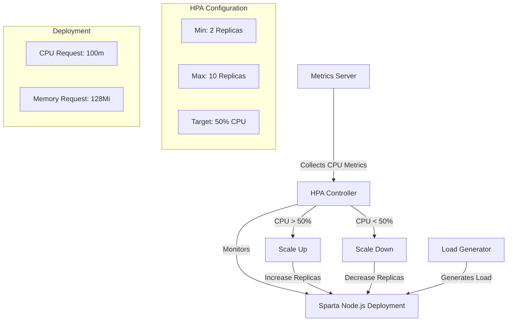
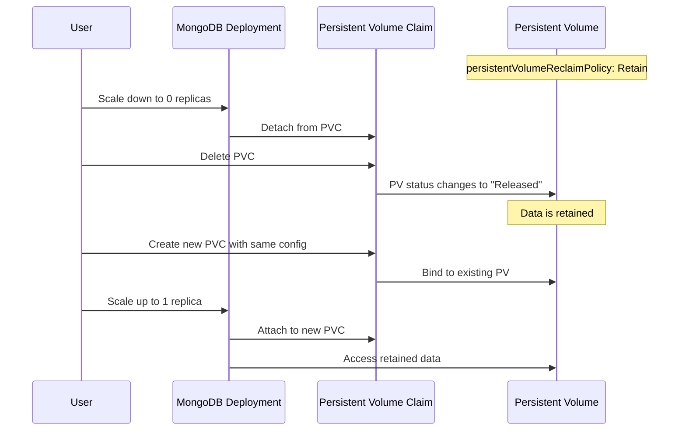
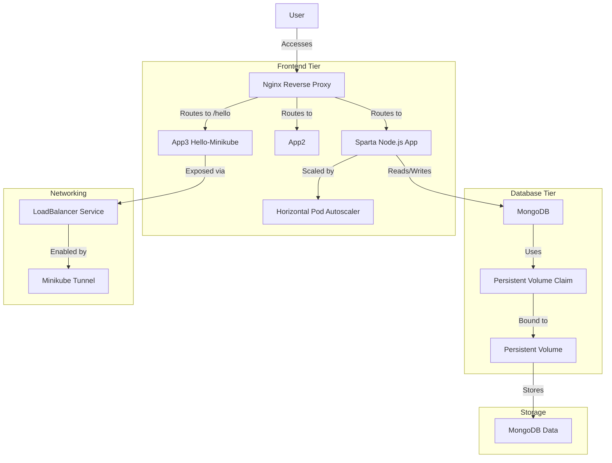
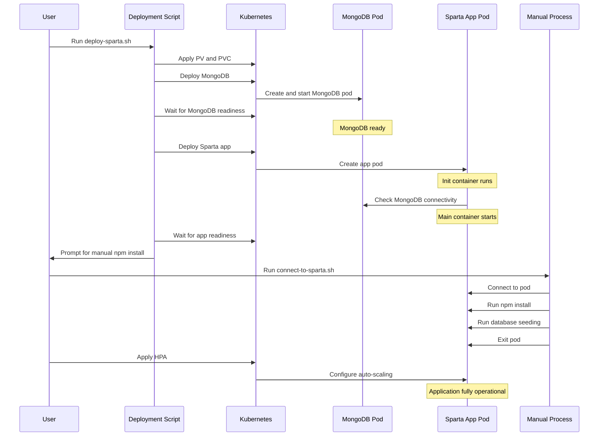
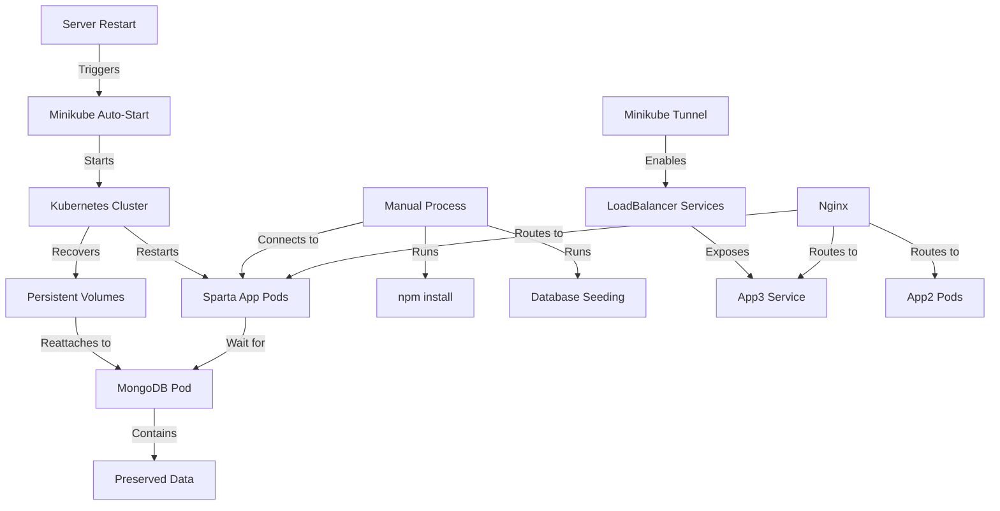

# Kubernetes Architecture and Deployment Diagrams

## Horizontal Pod Autoscaler (HPA) Flow

## PV/PVC Management Flow

## Complete System Architecture

## Deployment Workflow with Manual NPM Install

## Recovery Process After Server Restart

These diagrams illustrate the key components and flows of the complete Kubernetes setup, including the Horizontal Pod Autoscaler (HPA), Persistent Volume (PV) management, manual npm install process, and the overall system architecture with all applications.
