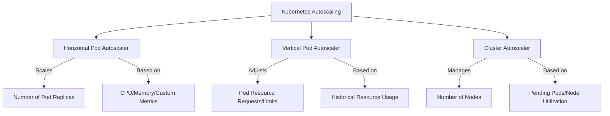
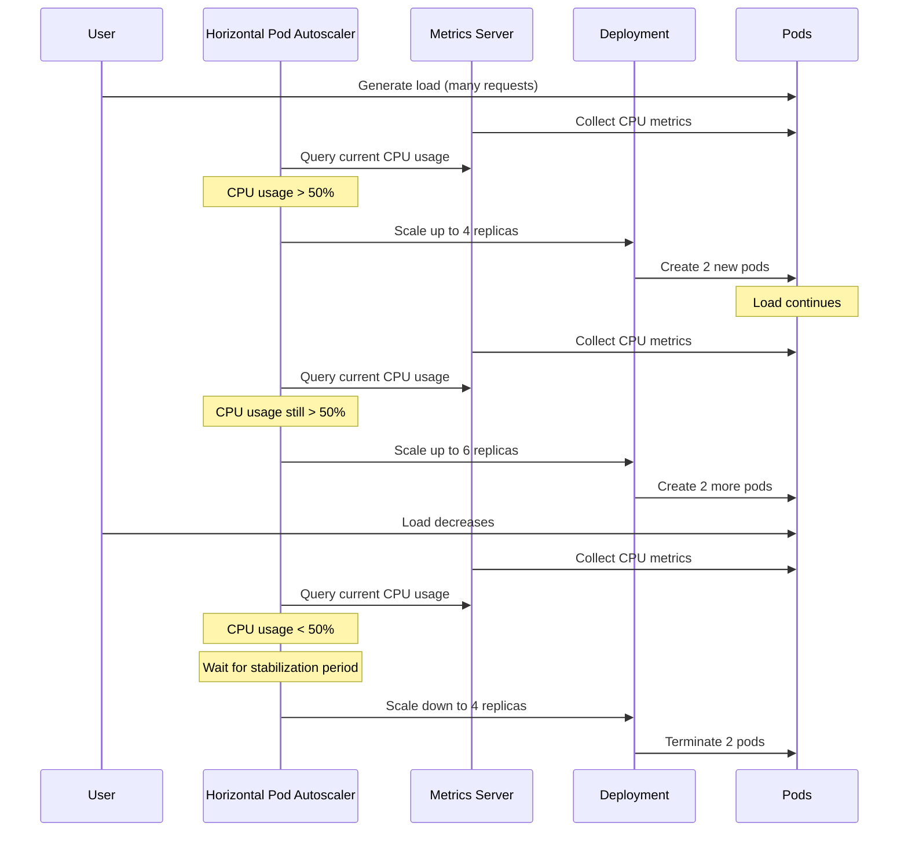

# Day 2: Autoscaling Strategies

## Table of Contents
- [Day 2: Autoscaling Strategies](#day-2-autoscaling-strategies)
  - [Table of Contents](#table-of-contents)
  - [2.2 Autoscaling in Kubernetes](#22-autoscaling-in-kubernetes)
    - [Types of Autoscaling](#types-of-autoscaling)
    - [Implementing Horizontal Pod Autoscaler (HPA)](#implementing-horizontal-pod-autoscaler-hpa)
      - [Prerequisite: The Metrics Server](#prerequisite-the-metrics-server)
      - [Create an HPA YAML (sparta-hpa.yaml):](#create-an-hpa-yaml-sparta-hpayaml)
    - [Testing the HPA](#testing-the-hpa)
    - [Troubleshooting HPA](#troubleshooting-hpa)
    - [Autoscaling Types Recap](#autoscaling-types-recap)
  - [References](#references)

## 2.2 Autoscaling in Kubernetes

### Types of Autoscaling

Kubernetes autoscaling happens at multiple levels:

* **Horizontal Pod Autoscaler (HPA)**: Scales the number of pod replicas for a deployment or statefulset based on observed metrics (like CPU, memory, or custom metrics) [1].

* **Vertical Pod Autoscaler (VPA)**: Adjusts the resource requests/limits for containers in pods (i.e., "vertical" scaling by giving pods more CPU/memory or less) [2].

* **Cluster Autoscaler**: Adds or removes worker nodes in the cluster based on pending pods or resource utilization [2].

These three can work in tandem – for example, HPA scales out pods, and if the cluster runs out of capacity, Cluster Autoscaler can add more nodes. VPA can right-size pods over time. In our environment (Docker Desktop), we only have one node and cannot add nodes, so cluster autoscaler isn't applicable. We'll focus on HPA (and mention VPA conceptually).



**Horizontal Pod Autoscaler (HPA)**: HPA is implemented as a Kubernetes controller that periodically (default every 15s) checks the metrics of pods in a target deployment and adjusts the replica count up or down to maintain a target usage [2]. For example, you can set an HPA to target 50% CPU utilization. If pods exceed that, HPA will scale out (add replicas) until average CPU is ~50%. If they're under-utilized, it will scale in (remove replicas) down to a minimum you specify. HPA can also scale on custom application metrics or even external metrics, but CPU and memory (resource metrics) are common.

**Vertical Pod Autoscaler (VPA)**: VPA monitors the actual resource usage of containers and can recommend or automatically adjust the CPU/memory requests of pods [2]. If a pod consistently uses more than its requested resources, VPA can increase the request so that next time the scheduler places it, it gets a guaranteed slice of CPU/memory. VPA can, however, conflict with HPA if both are scaling CPU – you typically don't run HPA on CPU and VPA on the same deployment simultaneously, because one is changing replica counts while the other changes individual pod sizes. In practice, VPA often runs in a recommendations mode, and is applied to slower-changing workloads.

**Cluster Autoscaler**: Runs typically as a separate component (often as a deployment in the cluster or an external process) and uses cloud provider APIs to provision new VMs (nodes) when the scheduler can't place pods due to lack of resources [2]. It also scales down by removing underutilized nodes (after rescheduling those pods elsewhere) [2]. In managed services like EKS/GKE, cluster autoscaler can be enabled to automatically manage node pools. In Docker Desktop or minikube, we can't really simulate this, as there's no cloud to provide new nodes.

### Implementing Horizontal Pod Autoscaler (HPA)

Let's implement an HPA for our Node.js app (the Sparta app). We want it to scale between 2 and 10 replicas based on load.

#### Prerequisite: The Metrics Server

Kubernetes HPA (for CPU/memory) relies on metrics API (metrics-server). Some clusters (like GKE) have it by default. Docker Desktop's Kubernetes usually has metrics-server installed by default (you can check: `kubectl get deployment metrics-server -n kube-system`). If not, you'd install it (there's a YAML or helm chart for metrics-server). Without metrics, HPA won't work (HPA will stay in "Unknown" state for metrics).

Assuming the metrics server is in place, we'll set the HPA to maintain ~50% CPU usage per pod as target. This means if CPU usage goes above 50%, the HPA will scale up the number of pods, and if it goes below 50%, it will scale down (but not below our minimum).

#### Create an HPA YAML (sparta-hpa.yaml):

```yaml
apiVersion: autoscaling/v2
kind: HorizontalPodAutoscaler
metadata:
  name: sparta-node-hpa
spec:
  scaleTargetRef:
    apiVersion: apps/v1
    kind: Deployment
    name: sparta-node-deployment
  minReplicas: 2
  maxReplicas: 10
  metrics:
  - type: Resource
    resource:
      name: cpu
      target:
        type: Utilization
        averageUtilization: 50
```

**Explanation**:

- `scaleTargetRef` points to the deployment we want to autoscale (our Node.js deployment).
- `minReplicas = 2`, `maxReplicas = 10` sets the range.
- `metrics`: using autoscaling/v2 API, we specify a CPU target. `averageUtilization: 50` means if the pods' average CPU usage > 50% of their request, HPA will scale up, and if it's consistently <50%, scale down (not below 2 though).

This assumes the pods have CPU requests set. If not, HPA uses some default or might not work; it's best to have a CPU request in the Node deployment spec, e.g., `resources: requests: cpu: 100m` etc., so that 50% of that = 50m usage triggers scale.

Apply this:

```bash
kubectl apply -f sparta-hpa.yaml
```

You can check the HPA status:

```bash
kubectl get hpa sparta-node-hpa
```

Initially it might say unknown or 0% CPU if idle. If your app is idle, HPA will scale it down to minReplicas (2). We set min 2, so it might actually scale down from 3 to 2 right away, since target is 50% and current usage is ~0%. Don't be surprised if you see it go to 2 replicas after a while.

### Testing the HPA

To see the HPA scale up, we need to load the app so CPU usage rises. There are a few ways to do this:

1. **Run a load test from your host or a container**
   
   You could use a tool like ab (ApacheBench) or hey or simply a looped curl. For example:
   
   ```bash
   # Send a bunch of parallel requests
   for i in {1..1000}; do curl -s http://localhost:30002/ > /dev/null & done
   ```
   
   If the Node app does some CPU work per request, this might increase CPU usage.

2. **Monitor the HPA**
   
   ```bash
   # Watch the HPA status
   kubectl get hpa sparta-node-hpa -w
   ```
   
   It will show current replicas, target, current usage%. It typically needs a couple of metrics samples (metrics-server scrapes every 10s or so, HPA checks every 15s).
   
   After a short time under heavy load, you should see CPU% go high and HPA will increase replicas (maybe to 4, then 6, etc., up to 10 if needed).
   
   Also watch the pods:
   
   ```bash
   # Watch the pods being created
   kubectl get pods -l app=sparta-node -w
   ```
   
   to see new pods spawn.

If the load stops, after a cooldown period (stabilization window by default a few minutes), HPA will scale back down, but not below 2 (min).



### Troubleshooting HPA

If you encounter issues with the HPA, here are some common troubleshooting steps:

- If `kubectl get hpa` shows `<unknown>` or no metrics, ensure metrics-server is running. You might need to install it (in Minikube, `minikube addons enable metrics-server`; in Docker Desktop, it should be included).

- If HPA scales up to max but performance is still low, you might be hitting node limits (in Docker Desktop, only 2 CPUs given). Our single-node can only run so many pods effectively. It's just to demonstrate.

- If pods have no resource requests, HPA can still scale based on actual usage (it defaults to using some base, but it's recommended to set requests).

- Remember HPA won't scale faster than one step per 15 seconds (and scale down is more conservative). So give it time.

### Autoscaling Types Recap

- **HPA** deals with replicating pods (scale out/in) [1]
- **VPA** deals with sizing pods
- **Cluster Autoscaler** deals with adding/removing nodes

They each address different levels of scaling:

- **HPA** = handle variable load by adjusting concurrency (more pods).
- **VPA** = ensure each pod has appropriate resources to avoid being underpowered or wasting resources.
- **Cluster Autoscaler** = ensure the cluster has enough machines to run the pods demanded (and not too many idle machines).

For our guide, implementing HPA is sufficient. In a production environment, you might consider using VPA for the MongoDB to give it more memory if it grows, but we won't implement that now.

After testing, you might remove the HPA if not needed:

```bash
kubectl delete hpa sparta-node-hpa
```

Or leave it – it's okay.

Now we have:
- Node app can auto-scale between 2 and 10 pods on CPU load.
- MongoDB doesn't auto-scale (that would be a StatefulSet usually, or one might scale read replicas, but not in scope).
- We preserved data on MongoDB via PV.

## References

[1] Kubernetes.io. "Horizontal Pod Autoscaler." [https://kubernetes.io/docs/tasks/run-application/horizontal-pod-autoscale/](https://kubernetes.io/docs/tasks/run-application/horizontal-pod-autoscale/)

[2] Spot.io. "Kubernetes Autoscaling: A Comprehensive Guide." [https://spot.io/resources/kubernetes-autoscaling/](https://spot.io/resources/kubernetes-autoscaling/)

[3] Kubernetes.io. "Metrics Server." [https://github.com/kubernetes-sigs/metrics-server](https://github.com/kubernetes-sigs/metrics-server)
