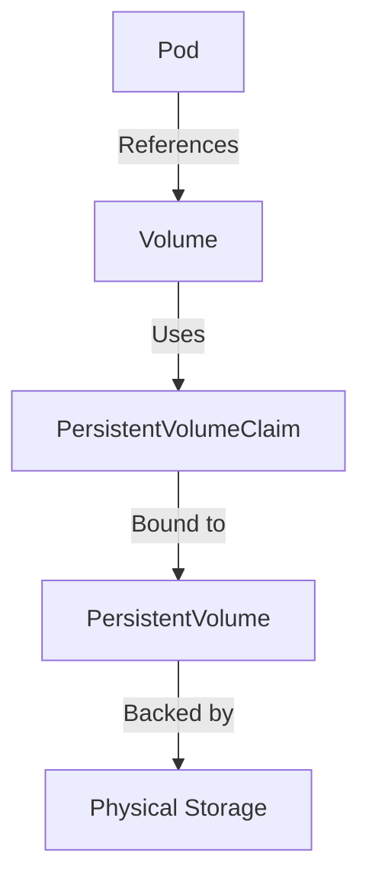

# Kubernetes Project Documentation

## Project Structure and Organization

This document explains the structure and organization of the Kubernetes guide project.

### Directory Structure

The project is organized into the following directories:

```
kubernetes-guide/
├── 00_Table_of_Contents.md
├── README.md
├── Project_Documentation.md
├── day1-fundamentals/
│   ├── 01_kubernetes_fundamentals.md
│   ├── 02_cluster_setup.md
│   ├── 03_basic_deployments.md
│   ├── 04_observing_behaviors.md
│   └── 05_nodejs_app_deployment.md
├── day2/
│   ├── 01_Persistent_Storage.md
│   └── 02_Autoscaling.md
└── day3/
    ├── 01_Minikube_Cloud_Setup.md
    └── 02_Advanced_Networking.md
```

### File Naming Convention

Files are named using a consistent pattern:
- Numeric prefix to indicate the order (e.g., `01_`, `02_`)
- Descriptive name using underscores to separate words
- `.md` extension for Markdown files

### Content Organization

The content is organized into three days, each focusing on different aspects of Kubernetes:

1. **Day 1: Kubernetes Fundamentals**
   - Basic concepts and architecture
   - Setting up a local Kubernetes cluster
   - Deploying simple applications
   - Understanding Kubernetes behaviors
   - Multi-tier application deployment

2. **Day 2: Persistent Storage & Scaling**
   - Working with persistent volumes
   - Implementing autoscaling strategies

3. **Day 3: Cloud Deployment & Networking**
   - Setting up Kubernetes on a cloud VM
   - Advanced networking configurations

### Navigation

There are multiple ways to navigate the guide:

1. **Table of Contents**: The `00_Table_of_Contents.md` file provides a comprehensive overview of all sections and subsections with direct links.

2. **README**: The `README.md` file provides a high-level overview of the guide and its structure.

3. **Sequential Reading**: Files are numbered sequentially, allowing for a linear progression through the material.

4. **Internal Links**: Each file contains internal links to related sections, allowing for non-linear exploration of topics.

## Mermaid Diagrams

The guide includes Mermaid diagrams to visually explain complex concepts. These diagrams are rendered in GitHub and other Markdown viewers that support Mermaid syntax.

Example:


## Code Blocks

Code blocks are used to show YAML manifests, shell commands, and other code examples. They are formatted with syntax highlighting for better readability.

Example:
```yaml
apiVersion: v1
kind: PersistentVolume
metadata:
  name: mongo-pv
spec:
  capacity:
    storage: 100Mi
  accessModes:
    - ReadWriteOnce
  hostPath:
    path: "/data/mongo"
  persistentVolumeReclaimPolicy: Retain
```

## References

Each file includes a References section at the end, providing links to official documentation and other resources for further reading.

Example:
```
## References

[1] Kubernetes.io. "Persistent Volumes." [https://kubernetes.io/docs/concepts/storage/persistent-volumes/](https://kubernetes.io/docs/concepts/storage/persistent-volumes/)
```

## Contribution Guidelines

If you wish to contribute to this guide, please follow these guidelines:

1. **File Naming**: Follow the existing naming convention.
2. **Content Structure**: Include a table of contents at the beginning of each file.
3. **Code Examples**: Provide clear, well-commented code examples with proper syntax highlighting.
4. **Diagrams**: Use Mermaid diagrams to illustrate complex concepts.
5. **References**: Include references to official documentation and other reliable sources.
6. **Formatting**: Use consistent formatting throughout the document.

## Maintenance

This guide is maintained to ensure it remains up-to-date with the latest Kubernetes features and best practices. If you find any errors or outdated information, please submit an issue or pull request.
