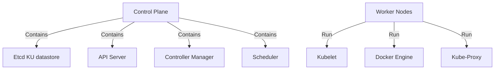

# Kubernetes Project: Comprehensive Guide

## Introduction

This guide provides a structured walkthrough of Kubernetes fundamentals and advanced features across three days. It is designed to take you from basic concepts to advanced deployments with hands-on exercises and detailed explanations.

## Prerequisites

- Basic understanding of containerization concepts
- Docker installed on your local machine
- Basic command-line knowledge
- A text editor for YAML file creation

## Project Structure

The project is organized into two main directories:

- `code/`: Contains all the Kubernetes YAML files, scripts, and application code
- `docs/`: Contains the documentation explaining the concepts and implementations

## Table of Contents

### Day 1: Kubernetes Fundamentals
1. [Kubernetes Concepts](day1-fundamentals/01_kubernetes_fundamentals.md)
   - Why Kubernetes is needed
   - Benefits of Kubernetes
   - Success stories
   - Architecture: clusters, nodes, and components
   - Kubernetes objects: Pods, ReplicaSets, Deployments
   - Security considerations
   
2. [Cluster Setup](day1-fundamentals/02_cluster_setup.md)
   - Setting up Kubernetes with Docker Desktop
   - Troubleshooting cluster startup
   
3. [Basic Deployments](day1-fundamentals/03_basic_deployments.md)
   - Nginx Deployment with NodePort Service
   - Understanding Deployment YAML
   - Service configuration
   
4. [Observing Kubernetes Behaviors](day1-fundamentals/04_observing_behaviors.md)
   - Pod self-healing
   - Scaling replicas dynamically
   - Zero downtime deployment updates
   - Resource cleanup
   
5. [Multi-tier Application Deployment](day1-fundamentals/05_nodejs_app_deployment.md)
   - Deploying a Node.js application
   - Setting up MongoDB
   - Connecting application components
   - Testing and troubleshooting

### Day 2: Persistent Storage & Scaling
1. [Persistent Volumes](day2/01_Persistent_Storage.md)
   - Understanding storage in Kubernetes
   - PersistentVolumes and PersistentVolumeClaims
   - Storage Classes
   - Stateful applications

2. [Autoscaling Strategies](day2/02_Autoscaling.md)
   - Horizontal Pod Autoscaling
   - Vertical Pod Autoscaling
   - Cluster Autoscaling
   - Resource metrics and custom metrics

### Day 3: Cloud Deployment & Networking
1. [Minikube on Cloud VM](day3/01_Minikube_Cloud_Setup.md)
   - Setting up a cloud VM
   - Installing Minikube and dependencies
   - Deploying applications on Minikube
   - Managing cloud resources

2. [Advanced Networking](day3/02_Advanced_Networking.md)
   - Configuring Nginx reverse proxy
   - Kubernetes networking concepts
   - LoadBalancer and NodePort services
   - Automating cluster startup

### Additional Documentation
1. [Minikube Tunnel Guide](app3/minikube-tunnel-guide.md)
   - Understanding minikube tunnel
   - Using LoadBalancer services locally
   - Troubleshooting tunnel issues

2. [Manual NPM Install Process](manual-npm-install-docs.md)
   - Connecting to pods
   - Running npm install manually
   - Database seeding

3. [Init Container Implementation](sparta-init-container-docs.md)
   - Using init containers for dependencies
   - Ensuring proper startup sequence

## Applications in this Project

The project includes several applications that demonstrate different Kubernetes concepts:

1. **App1**: A simple Nginx deployment accessed via NodePort
   - Located in `code/app1/`
   - Demonstrates basic deployment and service concepts

2. **App2**: Another web application using LoadBalancer service
   - Located in `code/app2/`
   - Demonstrates LoadBalancer service type

3. **App3**: An echo server that returns request information
   - Located in `code/app3/`
   - Demonstrates LoadBalancer with minikube tunnel

4. **Sparta App**: A Node.js application with MongoDB backend
   - Located in `code/sparta/` and `code/sparta-with-pv/`
   - Demonstrates multi-tier applications and persistent storage

## Architecture Overview

*The diagram above shows the key components of a Kubernetes cluster, including the Control Plane (which manages the cluster) and Worker Nodes (which run the containerized applications).*

## What You'll Learn

This guide includes:
- Detailed technical explanations of Kubernetes concepts
- Production-grade YAML manifests with explanations
- Hands-on exercises with step-by-step instructions
- Troubleshooting tips for common issues
- Best practices for security and deployment
- Architectural insights for scalable applications

## Scripts and Utilities

The `code/scripts/` directory contains various utility scripts to help with deployment and management:

- `deploy-sparta.sh`: Deploys the Sparta application
- `deploy-app1-app2.sh`: Deploys App1 and App2
- `deploy-all-apps.sh`: Deploys all applications
- `minikube-start.sh`: Starts Minikube with appropriate configuration
- `sparta-connect.sh`: Connects to the Sparta app pod for manual operations

## References

For more information, refer to:
- [Kubernetes Official Documentation](https://kubernetes.io/docs/home/)
- [Kubernetes GitHub Repository](https://github.com/kubernetes/kubernetes)
- [Kubernetes Community](https://kubernetes.io/community/)
- [CNCF Landscape](https://landscape.cncf.io/)
