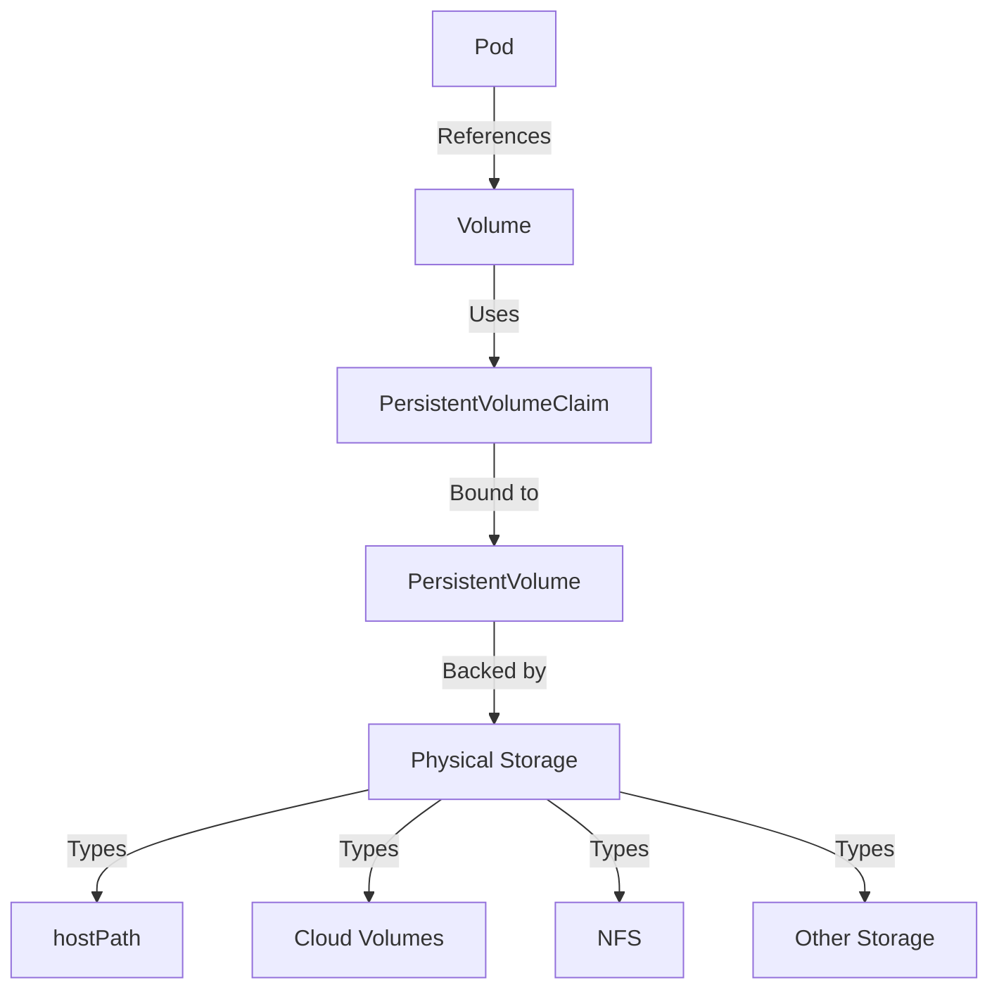

# Day 2: Persistent Storage

## Table of Contents
- [Day 2: Persistent Storage](#day-2-persistent-storage)
  - [Table of Contents](#table-of-contents)
  - [2.1 Persistent Volumes](#21-persistent-volumes)
    - [Understanding Persistent Storage for Databases](#understanding-persistent-storage-for-databases)
    - [Creating a PersistentVolume](#creating-a-persistentvolume)
    - [Creating a PersistentVolumeClaim](#creating-a-persistentvolumeclaim)
    - [Modifying MongoDB Deployment to Use Persistent Storage](#modifying-mongodb-deployment-to-use-persistent-storage)
    - [Verifying Data Persistence](#verifying-data-persistence)
    - [Kubernetes PV/PVC Architecture](#kubernetes-pvpvc-architecture)
    - [PVC Removal While Retaining Data](#pvc-removal-while-retaining-data)
  - [References](#references)

## 2.1 Persistent Volumes

### Understanding Persistent Storage for Databases

On Day 1, we deployed MongoDB with its storage in the container's filesystem (which in Kubernetes by default is ephemeral storage on the node). This means if the MongoDB pod restarts or is rescheduled, all data would be lost, which is not acceptable for a database in most cases.

To fix this issue, we use Kubernetes PersistentVolumes (PV) and PersistentVolumeClaims (PVC) to provide durable storage:

- A **PersistentVolume (PV)** is a piece of storage in the cluster that has been provisioned for use by pods [1]. It exists independently of any individual pod's lifecycle. In other words, a PV is like a disk (could be backed by cloud storage, NFS, or local disk) that remains even if pods come and go.

- A **PersistentVolumeClaim (PVC)** is essentially a request for a PV of a certain size and type [1]. It's how a pod "claims" storage.

Kubernetes decouples the request (PVC) from the actual resource (PV) so that developers can just ask for storage and administrators can provide different types of storage without the pod needing to know the details. The cluster will bind a PVC to a suitable PV if one is available.

In our case, we'll create a hostPath PV (since on Docker Desktop, we can use the host filesystem for simplicity). Docker Desktop's Kubernetes might also have a default storage class that dynamically provisions hostPath volumes, but we'll demonstrate with a static PV/PVC.



### Creating a PersistentVolume

Let's create a PersistentVolume YAML file (pv.yml):

```yaml
apiVersion: v1
kind: PersistentVolume
metadata:
  name: sparta-db-pv
spec:
  capacity:
    storage: 100Mi
  accessModes:
    - ReadWriteOnce
  hostPath:
    path: "/data/mongodb"
  persistentVolumeReclaimPolicy: Retain
  storageClassName: ""
```

This PV definition includes:

- **Capacity**: 100Mi (just for testing, 0.1GB). Ensure your Docker Desktop VM has that space free (it should).
- **AccessModes**: ReadWriteOnce (means it can be mounted by one node at a time in read-write – that's fine because we only have one node and one pod for MongoDB).
- **hostPath**: "/data/mongodb" on the node – this is a directory on the node's filesystem. Docker Desktop's node is a VM where /data/mongodb will be created. (Using hostPath ties us to that environment, but it's simplest for demo. On a real cluster, you'd use network storage or cloud volumes.)
- **ReclaimPolicy**: Retain – this is important. It means if we delete the PVC later, the PV is not automatically deleted. The data remains on disk until an admin manually cleans it or reassigns it. We choose Retain because one of our tasks is to remove the PVC while retaining data.
- **storageClassName**: "" - We explicitly set this to an empty string to indicate we're not using a storage class, which helps avoid binding issues.

### Creating a PersistentVolumeClaim

Next, let's create a PersistentVolumeClaim to actually use this PV. In our project, both the PV and PVC are defined in the same file (pv.yml):

```yaml
apiVersion: v1
kind: PersistentVolumeClaim
metadata:
  name: sparta-db-pvc
spec:
  accessModes:
    - ReadWriteOnce
  resources:
    requests:
      storage: 100Mi
  volumeName: sparta-db-pv
  storageClassName: ""
```

In this PVC:

- We request 100Mi storage with ReadWriteOnce access (matching what the PV offers).
- By specifying `volumeName: sparta-db-pv`, we explicitly bind to the PV we created. (Alternatively, one could rely on label matching or storageClass binding, but explicit binding is fine here since we know the PV name.)
- We explicitly set `storageClassName: ""` to indicate we're not using a storage class, which helps avoid binding issues.

Apply the PV and PVC:

```bash
kubectl apply -f code/sparta-with-pv/pv.yml
```

Check the status:

```bash
kubectl get pv sparta-db-pv
kubectl get pvc sparta-db-pvc
```

The PV's STATUS should change to "Bound" (bound to the PVC) [2]. The PVC's status becomes "Bound" as well, indicating it successfully claimed the PV.

### Modifying MongoDB Deployment to Use Persistent Storage

Now we need to modify the MongoDB Deployment to use this storage. We'll add a volume and volumeMount to the pod spec.

Here's how our MongoDB deployment is configured in `code/sparta-with-pv/sparta-deploy.yml`:

```yaml
apiVersion: apps/v1
kind: Deployment
metadata:
  name: sparta-db-deployment
spec:
  replicas: 1  # Using 1 replica since we're using ReadWriteOnce PV
  selector:
    matchLabels:
      app: sparta-db
  template:
    metadata:
      labels:
        app: sparta-db
    spec:
      containers:
        - name: sparta-db
          image: mongo:latest
          ports:
            - containerPort: 27017
          volumeMounts:
            - name: mongodb-data
              mountPath: /data/db
      volumes:
        - name: mongodb-data
          persistentVolumeClaim:
            claimName: sparta-db-pvc
```

Key points about this configuration:

- We set `replicas: 1` because our PV has ReadWriteOnce access mode, which only allows mounting by one node at a time.
- We add a `volumeMounts` entry to mount our volume at `/data/db` (that's where MongoDB stores its database files inside the container by default).
- We add a `volumes` section referencing `sparta-db-pvc`. This tells Kubernetes to attach the PV (via the claim) to the pod.

Apply the updated deployment:

```bash
kubectl apply -f code/sparta-with-pv/sparta-deploy.yml
```

Since we changed the pod spec, Kubernetes will terminate the old MongoDB pod and create a new one (rolling update with maxUnavailable=0 or 1). The new pod will start MongoDB and now it will be writing data to the host path `/data/mongodb` on the node, which is persisted.

### Verifying Data Persistence

To verify that our data persists across pod restarts:

1. Connect to MongoDB and add some sample data:

```bash
# Get the MongoDB pod name
MONGO_POD=$(kubectl get pod -l app=sparta-db -o jsonpath='{.items[0].metadata.name}')

# Insert a test document
kubectl exec -it $MONGO_POD -- mongosh --eval 'db.posts.insert({title:"Test Post", body:"This is a test post to verify data persistence"})'
```

2. Delete the MongoDB pod to force a restart:

```bash
kubectl delete pod -l app=sparta-db
```

The Deployment will start a new pod. When the new pod comes up, it will mount the same `/data/mongodb` path.

3. Check if the data persisted:

```bash
# Get the new MongoDB pod name
NEW_MONGO_POD=$(kubectl get pod -l app=sparta-db -o jsonpath='{.items[0].metadata.name}')

# Query for the test document
kubectl exec -it $NEW_MONGO_POD -- mongosh --eval 'db.posts.find().pretty()'
```

You should see the document you inserted. This confirms that the data persisted across pod restarts because it was stored on the PV which outlived the first pod.

### Kubernetes PV/PVC Architecture

With this setup:
- The PersistentVolume is a cluster resource
- The PersistentVolumeClaim is a way for the pod to use that resource
- The pod references the PVC, which is bound to the PV
- The data is stored on the node's filesystem (since we used hostPath)

Note that if this single Docker Desktop node VM were destroyed, the data goes with it. In a cloud scenario, typically the PV would be something like an AWS EBS volume which could potentially be reattached to a new node if the old node dies.

The concept, however, is that the PV is independent of the pod's lifecycle – "PVs belong to the cluster and exist independently of pods. Any data on a PV continues to exist even if the pod is deleted." [2]. The PVC is what allowed the pod to "claim" that storage and mount it.

### PVC Removal While Retaining Data

Let's simulate the scenario: remove the PVC but keep the PV (and data). Ensure the MongoDB pod is not running or using it first (you can scale down or delete the MongoDB deployment before this, so it releases the volume). Then:

```bash
# Scale down the MongoDB deployment to ensure no pods are using the volume
kubectl scale deployment sparta-db-deployment --replicas=0

# Delete the PVC
kubectl delete pvc sparta-db-pvc
```

Now run:

```bash
kubectl get pv sparta-db-pv
```

You will see its STATUS is "Released" (meaning it's no longer bound to a claim) and it is not available for another claim yet because the data might still be there and it's in Retain state. If you describe the PV, Kubernetes will note that manual intervention is needed to reuse it (you'd have to either wipe the data or manually clear the released condition).

The important thing is the data on disk wasn't deleted when the PVC was deleted [3]. If we had set `reclaimPolicy: Delete`, then deleting the PVC would have also deleted the PV and, by extension, likely wiped the storage (e.g., deleted the cloud disk or removed the files for hostPath). Retain gives you the chance to recover data or rebind the PV later.

To make the PV available again, you could use:

```bash
kubectl patch pv sparta-db-pv -p '{"spec":{"claimRef": null}}'
```

Then re-create a PVC to rebind. In our project, we have a file `code/sparta-with-pv/pvc-recreate.yml` that can be used to create a new PVC that binds to the existing PV:

```bash
kubectl apply -f code/sparta-with-pv/pvc-recreate.yml
```

After recreating the PVC, you can scale the deployment back up:

```bash
kubectl scale deployment sparta-db-deployment --replicas=1
```

In practice, if you delete a PVC accidentally but want to keep data, with Retain you can create a new PVC that manually binds to that PV (by name, like we did with volumeName earlier). This allows you to recover your data.

## References

[1] Kubernetes.io. "Persistent Volumes." [https://kubernetes.io/docs/concepts/storage/persistent-volumes/](https://kubernetes.io/docs/concepts/storage/persistent-volumes/)

[2] Spot.io. "Kubernetes Storage: Persistent Volumes, Claims, and More." [https://spot.io/resources/kubernetes-architecture/kubernetes-storage-101/](https://spot.io/resources/kubernetes-architecture/kubernetes-storage-101/)

[3] K21Academy.com. "Kubernetes Storage: PV, PVC, and StorageClass." [https://k21academy.com/docker-kubernetes/kubernetes-storage/](https://k21academy.com/docker-kubernetes/kubernetes-storage/)
