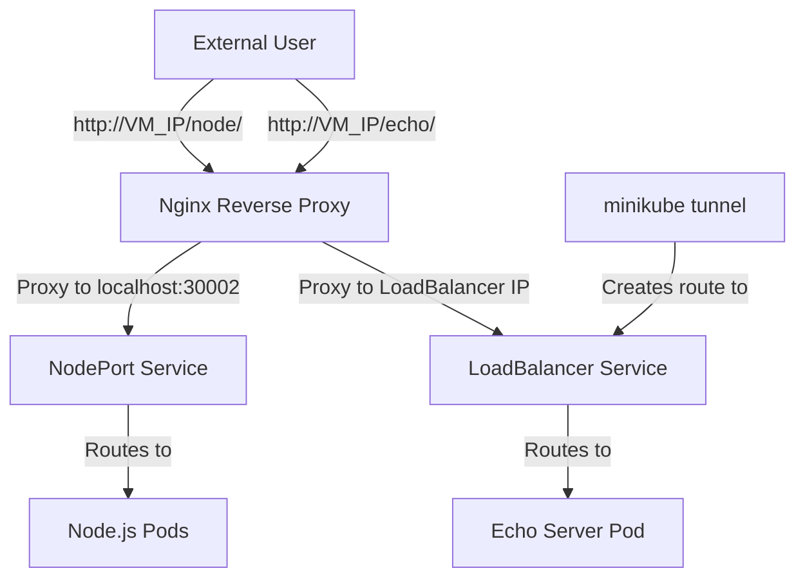

# Day 3: Advanced Networking

## Table of Contents
- [Day 3: Advanced Networking](#day-3-advanced-networking)
  - [Table of Contents](#table-of-contents)
  - [3.2 Advanced Networking](#32-advanced-networking)
    - [Configuring Nginx Reverse Proxy](#configuring-nginx-reverse-proxy)
    - [Testing the Setup](#testing-the-setup)
    - [Minikube Networking Concepts](#minikube-networking-concepts)
    - [Cleanup and Management](#cleanup-and-management)
  - [References](#references)

## 3.2 Advanced Networking

Now that we have our applications deployed on Minikube, we need to configure an Nginx reverse proxy on the VM to route external traffic to our services. This approach allows us to expose multiple applications through a single entry point (port 80) rather than requiring users to specify different ports.

### Configuring Nginx Reverse Proxy

We have two applications to expose:
- Node.js app on NodePort 30002
- Echo app on LoadBalancer IP

We will configure Nginx (on the host VM, not the one in cluster) to listen on port 80 and proxy based on URL path:
- `http://<VM IP>/node/*` → forwards to localhost:30002 (the NodePort of Node.js app)
- `http://<VM IP>/echo/*` → forwards to the echo service

For the echo service, we'll use the LoadBalancer IP assigned by Minikube tunnel. After running `minikube tunnel`, the LoadBalancer IP (e.g., 10.96.0.200) becomes accessible on the host, so Nginx on the host can proxy to that IP.

**Steps to configure Nginx reverse proxy:**

1. **Install Nginx on the Ubuntu VM**

```bash
sudo apt-get install -y nginx
```

Nginx will likely start automatically listening on port 80.

2. **Configure Nginx**

Edit the default site configuration:

```bash
sudo nano /etc/nginx/sites-available/default
```

Replace the content with:

```nginx
server {
    listen 80;
    server_name _;

    location /node/ {
        proxy_pass http://127.0.0.1:30002/;
        # Strip the /node prefix when proxying
        rewrite ^/node/(.*)$ /$1 break;
        
        # Standard proxy headers
        proxy_set_header Host $host;
        proxy_set_header X-Real-IP $remote_addr;
        proxy_set_header X-Forwarded-For $proxy_add_x_forwarded_for;
        proxy_set_header X-Forwarded-Proto $scheme;
    }

    location /echo/ {
        # Replace 10.96.0.200 with your actual LoadBalancer IP
        proxy_pass http://10.96.0.200:8080/;
        rewrite ^/echo/(.*)$ /$1 break;
        
        # Standard proxy headers
        proxy_set_header Host $host;
        proxy_set_header X-Real-IP $remote_addr;
        proxy_set_header X-Forwarded-For $proxy_add_x_forwarded_for;
        proxy_set_header X-Forwarded-Proto $scheme;
    }
}
```

This configuration assumes:
- The Node.js app is fine with or without the `/node` prefix (we strip it when proxying)
- The echo server returns what you send and doesn't care about the path

3. **Test and apply the Nginx configuration**

```bash
# Test the configuration
sudo nginx -t

# If the test passes, restart Nginx to apply changes
sudo systemctl restart nginx
```



### Testing the Setup

From your local machine, you can now access the applications using the VM's public IP:

- `http://<VM_PUBLIC_IP>/node/` → should reach the Node.js app
- `http://<VM_PUBLIC_IP>/echo/` → should hit the echo server and return request details

This setup is essentially acting like an Ingress controller: Nginx is forwarding traffic to services based on the URL path. In a production environment, you might use a Kubernetes Ingress Controller inside the cluster instead of manually configuring Nginx on the host.

### Minikube Networking Concepts

Important points to understand about Minikube networking:

1. **NodePort Services**
   - A NodePort service is accessible via `NodeIP:NodePort`
   - In our VM, the NodeIP is typically 192.168.49.2 (Minikube's default VM IP)
   - We use localhost in Nginx because we're on the same host
   - From outside, you either open the NodePort directly or use a proxy (as we did)

2. **LoadBalancer Services with minikube tunnel**
   - Minikube allocates a pseudo-external IP and routes traffic from host to service
   - This simulates cloud LoadBalancers
   - The tunnel must run constantly for the IP to work
   - Run with `sudo minikube tunnel` to allow binding to privileged ports

3. **Nginx as a Gateway**
   - We funnel all traffic through Nginx on port 80, which is commonly open
   - This is a common pattern in production: using a gateway like Nginx or HAProxy
   - It allows for path-based routing without exposing multiple ports

### Cleanup and Management

When you're done with your Minikube cluster, you can:

1. **Stop the cluster**
   ```bash
   minikube stop
   ```

2. **Configure Minikube to start on boot**

   Create a systemd unit file:
   ```bash
   sudo nano /etc/systemd/system/minikube.service
   ```

   Add the following content:
   ```ini
   [Unit]
   Description=Minikube
   After=docker.service
   Requires=docker.service

   [Service]
   User=root
   ExecStart=/usr/local/bin/minikube start --driver=docker
   ExecStop=/usr/local/bin/minikube stop
   RemainAfterExit=yes

   [Install]
   WantedBy=multi-user.target
   ```

   Enable the service to start on boot:
   ```bash
   sudo systemctl enable minikube.service
   ```

   This will try to start Minikube on boot. Make sure Docker is up before it runs (we specified `After=` and `Requires=docker.service`).

   Note: `minikube start` might hang if run at boot without a TTY. If this happens, you might need to use cron with `@reboot` to run Minikube start instead.

3. **Test the auto-start configuration**
   
   Reboot the VM and verify that Minikube starts automatically:
   ```bash
   sudo reboot
   ```

   After the VM comes back up, check if Minikube is running:
   ```bash
   kubectl get nodes
   ```

With everything running, we've successfully deployed our applications in the cloud:
- Node.js + MongoDB with PV (100MB as specified) and HPA
- Exposed via Nginx on port 80 so users can access without specifying a port
- Verified that HPA works on the cloud VM cluster (you might need to enable metrics-server on Minikube: `minikube addons enable metrics-server`)

## References

[1] Kubernetes.io. "Service Types." [https://kubernetes.io/docs/concepts/services-networking/service/#publishing-services-service-types](https://kubernetes.io/docs/concepts/services-networking/service/#publishing-services-service-types)

[2] Nginx.org. "Nginx Reverse Proxy." [https://docs.nginx.com/nginx/admin-guide/web-server/reverse-proxy/](https://docs.nginx.com/nginx/admin-guide/web-server/reverse-proxy/)

[3] Minikube.sigs.k8s.io. "Minikube Tunnel." [https://minikube.sigs.k8s.io/docs/handbook/accessing/#loadbalancer-access](https://minikube.sigs.k8s.io/docs/handbook/accessing/#loadbalancer-access)

[4] Systemd.io. "Systemd Service Files." [https://www.freedesktop.org/software/systemd/man/systemd.service.html](https://www.freedesktop.org/software/systemd/man/systemd.service.html)
