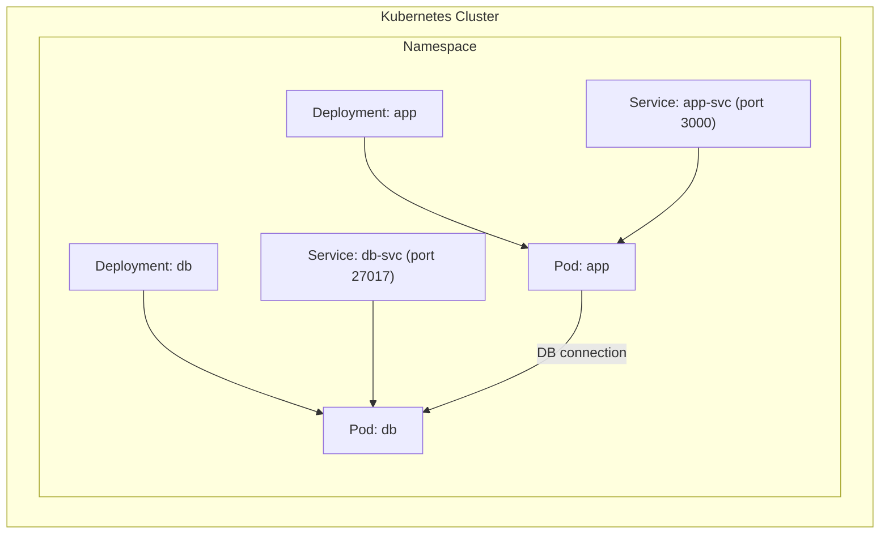

To deploy this NGINX configuration using kubectl, you'll need to use the `apply` command. Here's the command:

```bash
kubectl apply -f nginx-deploy.yml
```

This command will:

- `kubectl`: The command-line tool for Kubernetes
- `apply`: Creates or updates resources in a cluster
- `-f`: Specifies that we're using a file
- [nginx-deploy.yml](vscode-file://vscode-app/Applications/Visual%20Studio%20Code.app/Contents/Resources/app/out/vs/code/electron-sandbox/workbench/workbench.html): The name of your deployment configuration file

After running this command, you can verify the deployment with:

```bash
kubectl get deployments
kubectl get pods
```

To check the status and details of your deployment:

```bash
kubectl describe deployment nginx-deployment
```

If you need to delete this deployment later:

```bash
kubectl delete -f nginx-deploy.yml
```

To manage replicas, you have several options:

1. **Scale deployment using command line**:
```bash
		kubectl scale deployment nginx-deployment --replicas=0
```

 1. **Edit the deployment directly**:
```bash
	    kubectl edit deployment nginx-deployment
```

To find the IP address and port of your NGINX deployment, you'll need to run a few commands:
```bash
		kubectl get services
```

1. **Get detailed information about pods**:
```bash
	   kubectl get pods -o wide
```
1.  **To get specific pod's IP address**:
```bash
   kubectl describe pod <pod-name>
```

Based on your terminal output, I notice that you haven't created a Service yet to expose your NGINX deployment. The pods are only accessible within the cluster (internal IPs: 10.1.0.6, 10.1.0.7, 10.1.0.8).

To make your NGINX deployment accessible via browser, you need to:

1. First, create a Service. Create a file named `nginx-service.yml`:
```bash
   apiVersion: v1
kind: Service
metadata:
  name: nginx-service
spec:
  type: NodePort
  selector:
    app: nginx
  ports:
    - port: 80
      targetPort: 80
```

1. Apply the service:
```bash
   kubectl apply -f nginx-service.yml
```
1. Get the service URL (if using Docker Desktop):
```bash
   kubectl get service nginx-service
```
Once you run these commands, you can access the application through:

- If using Docker Desktop: `localhost:<NodePort>`
- The NodePort will be automatically assigned (typically in range 30000-32767)

To get the exact port, run:
```bash
kubectl get service nginx-service --output='jsonpath="{.spec.ports[0].nodePort}"'
```

Then you can access your application at: `http://localhost:<nodePort>`

### Method 1: Edit the Deployment in Real-Time

1. **Run the Edit Command**  
    Open the deployment for editing:
    
```bash
    kubectl edit deployment nginx-deployment
```
    
2. **Change the Number of Replicas**  
    In the editor, locate the `spec` section and change the value of `replicas` from its current value (likely 3) to **4**.
    
**Verify the Change**  
Check that the number of replicas has increased to 4:

```bash
kubectl get deployment nginx-deployment
```

You should see the updated number of replicas.




# NodePort Explanation

`NodePort` is required when you want to make your service accessible from outside the Kubernetes cluster. Here's why:

1. **Service Types in Kubernetes:**
    
    - `ClusterIP` (default): Only accessible within the cluster
    - `NodePort`: Exposes the service on each Node's IP at a static port
    - `LoadBalancer`: Exposes the service externally using cloud provider's load balancer
2. **How NodePort Works:**
```
		                                    NodePort (30002)
                                          ↓
Internet → Node (Host Machine) → Service → Pod (Your App)
                                          ↑
                                    Target Port (3000)
```

1. **Port Definitions in Your Service:**
```
   ports:
  - port: 3000        # Port exposed internally in the cluster
    targetPort: 3000  # Port your application listens on in the pod
    nodePort: 30002   # External port (must be 30000-32767)
```
**Without NodePort:**

- Your service would only be accessible within the cluster
- External clients (like web browsers) couldn't reach your application

**With NodePort:**

- Your application is accessible at `http://localhost:30002`
- Any external client can access the service
- Useful for development and testing environments

The `nodePort: 30002` in your service configuration explicitly sets the external port to 30002. If not specified, Kubernetes would randomly assign a port in the valid range.