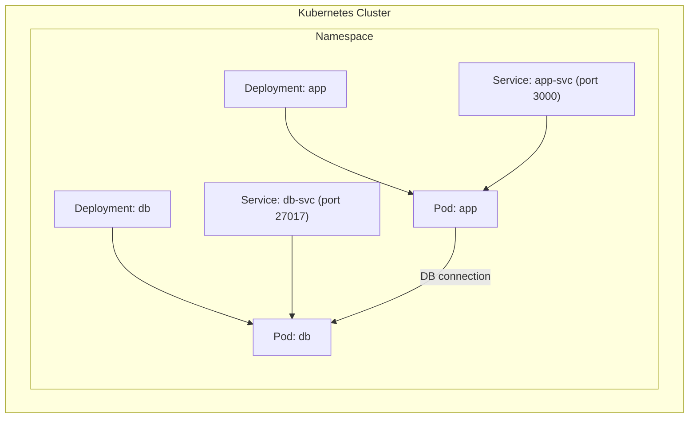
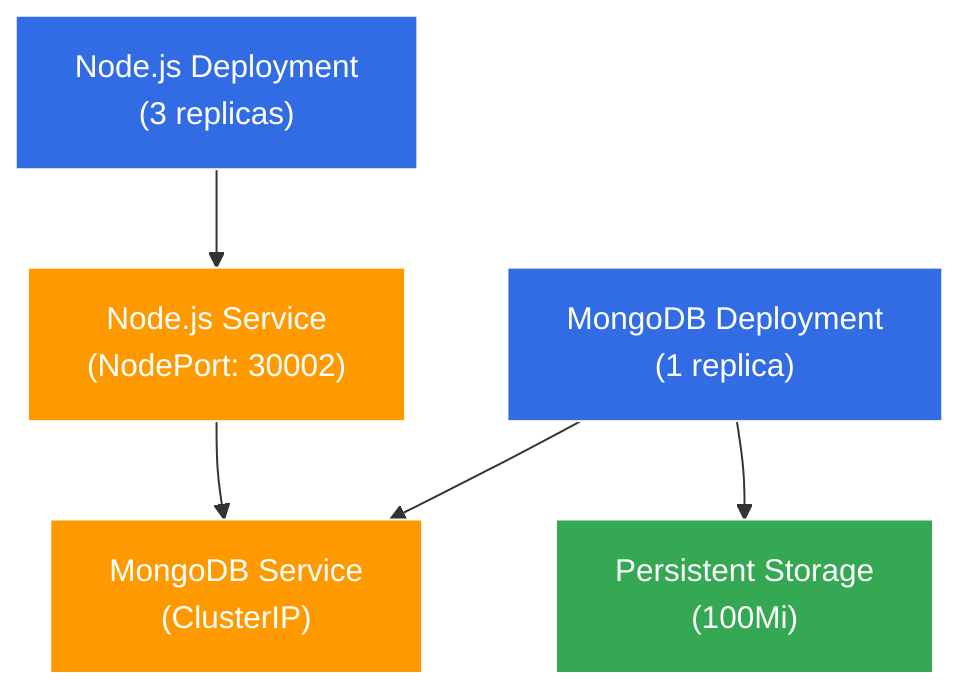

To deploy this NGINX configuration using kubectl, you'll need to use the `apply` command. Here's the command:

```bash
kubectl apply -f nginx-deploy.yml
```

This command will:

- `kubectl`: The command-line tool for Kubernetes
- `apply`: Creates or updates resources in a cluster
- `-f`: Specifies that we're using a file
- [nginx-deploy.yml](vscode-file://vscode-app/Applications/Visual%20Studio%20Code.app/Contents/Resources/app/out/vs/code/electron-sandbox/workbench/workbench.html): The name of your deployment configuration file

After running this command, you can verify the deployment with:

```bash
kubectl get deployments
kubectl get pods
```

To check the status and details of your deployment:

```bash
kubectl describe deployment nginx-deployment
```

If you need to delete this deployment later:

```bash
kubectl delete -f nginx-deploy.yml
```

To manage replicas, you have several options:

1. **Scale deployment using command line**:
```bash
		kubectl scale deployment nginx-deployment --replicas=0
```

 1. **Edit the deployment directly**:
```bash
	    kubectl edit deployment nginx-deployment
```

To find the IP address and port of your NGINX deployment, you'll need to run a few commands:
```bash
		kubectl get services
```

1. **Get detailed information about pods**:
```bash
	   kubectl get pods -o wide
```
1.  **To get specific pod's IP address**:
```bash
   kubectl describe pod <pod-name>
```

Based on your terminal output, I notice that you haven't created a Service yet to expose your NGINX deployment. The pods are only accessible within the cluster (internal IPs: 10.1.0.6, 10.1.0.7, 10.1.0.8).

To make your NGINX deployment accessible via browser, you need to:

1. First, create a Service. Create a file named `nginx-service.yml`:
```bash
   apiVersion: v1
kind: Service
metadata:
  name: nginx-service
spec:
  type: NodePort
  selector:
    app: nginx
  ports:
    - port: 80
      targetPort: 80
```

1. Apply the service:
```bash
   kubectl apply -f nginx-service.yml
```
1. Get the service URL (if using Docker Desktop):
```bash
   kubectl get service nginx-service
```
Once you run these commands, you can access the application through:

- If using Docker Desktop: `localhost:<NodePort>`
- The NodePort will be automatically assigned (typically in range 30000-32767)

To get the exact port, run:
```bash
kubectl get service nginx-service --output='jsonpath="{.spec.ports[0].nodePort}"'
```

Then you can access your application at: `http://localhost:<nodePort>`

### Method 1: Edit the Deployment in Real-Time

1. **Run the Edit Command**  
    Open the deployment for editing:
    
```bash
    kubectl edit deployment nginx-deployment
```
    
2. **Change the Number of Replicas**  
    In the editor, locate the `spec` section and change the value of `replicas` from its current value (likely 3) to **4**.
    
**Verify the Change**  
Check that the number of replicas has increased to 4:

```bash
kubectl get deployment nginx-deployment
```

You should see the updated number of replicas.




# NodePort Explanation

`NodePort` is required when you want to make your service accessible from outside the Kubernetes cluster. Here's why:

1. **Service Types in Kubernetes:**
    
    - `ClusterIP` (default): Only accessible within the cluster
    - `NodePort`: Exposes the service on each Node's IP at a static port
    - `LoadBalancer`: Exposes the service externally using cloud provider's load balancer
2. **How NodePort Works:**
```
		                                    NodePort (30002)
                                          ↓
Internet → Node (Host Machine) → Service → Pod (Your App)
                                          ↑
                                    Target Port (3000)
```

1. **Port Definitions in Your Service:**
```
   ports:
  - port: 3000        # Port exposed internally in the cluster
    targetPort: 3000  # Port your application listens on in the pod
    nodePort: 30002   # External port (must be 30000-32767)
```
**Without NodePort:**

- Your service would only be accessible within the cluster
- External clients (like web browsers) couldn't reach your application

**With NodePort:**

- Your application is accessible at `http://localhost:30002`
- Any external client can access the service
- Useful for development and testing environments

The `nodePort: 30002` in your service configuration explicitly sets the external port to 30002. If not specified, Kubernetes would randomly assign a port in the valid range.


## Introduction

In this project, we implemented a 2-tier application in Kubernetes with persistent storage for the database. A 2-tier application consists of:

1. A front-end application tier (NodeJS app)
2. A database tier (MongoDB)

The key challenge was to ensure that the database data persists even if the database pod is deleted or restarted. We achieved this using Kubernetes Persistent Volumes (PV) and Persistent Volume Claims (PVC).

## What are Persistent Volumes and Persistent Volume Claims?

Before diving into the implementation, let's understand some basic concepts:

- **Persistent Volume (PV)**: Think of this as a piece of storage in your cluster that has been provisioned by an administrator. It's like a virtual hard drive that exists independently of any pod.
    
- **Persistent Volume Claim (PVC)**: This is a request for storage by a user. It's like saying "I need a 100MB disk for my application." Kubernetes then finds a suitable PV to fulfill this claim.
    
- **Volume Mount**: This is how a container in a pod accesses the storage. It's like connecting the virtual hard drive to a specific folder in your container.
    

## Implementation Steps

### 1. Creating the Persistent Volume (PV)

First, we created a PV with the following characteristics:

- 100Mi storage capacity (small size as recommended)
- ReadWriteOnce access mode (can be mounted by one node at a time)
- hostPath storage (stores data on the host machine)
- Retain reclaim policy (ensures data is not deleted when PVC is deleted)

```yaml
apiVersion: v1
kind: PersistentVolume
metadata:
  name: sparta-db-pv
spec:
  capacity:
    storage: 100Mi
  accessModes:
    - ReadWriteOnce
  hostPath:
    path: "/data/mongodb"
  persistentVolumeReclaimPolicy: Retain
  storageClassName: ""
```

### 2. Creating the Persistent Volume Claim (PVC)

Next, we created a PVC to request storage from our PV:

```yaml
apiVersion: v1
kind: PersistentVolumeClaim
metadata:
  name: sparta-db-pvc
spec:
  accessModes:
    - ReadWriteOnce
  resources:
    requests:
      storage: 100Mi
  volumeName: sparta-db-pv
  storageClassName: ""
```

### 3. Modifying the MongoDB Deployment

We updated the MongoDB deployment to use the PVC:

- Reduced replicas to 1 (since we're using ReadWriteOnce access mode)
- Added a volume mount to connect the PVC to MongoDB's data directory (/data/db)

```yaml
apiVersion: apps/v1
kind: Deployment
metadata:
  name: sparta-db-deployment
spec:
  replicas: 1
  selector:
    matchLabels:
      app: sparta-db
  template:
    metadata:
      labels:
        app: sparta-db
    spec:
      containers:
        - name: sparta-db
          image: mongo:latest
          ports:
            - containerPort: 27017
          volumeMounts:
            - name: mongodb-data
              mountPath: /data/db
      volumes:
        - name: mongodb-data
          persistentVolumeClaim:
            claimName: sparta-db-pvc
```

### 4. Testing Data Persistence

#### Initial Setup

Before testing data persistence, ensure that the persistent volume infrastructure is properly set up:

```bash
# Check if PV and PVC exist
kubectl get pv
kubectl get pvc

# If they don't exist (as shown in the errors below), create them
# Error: persistentvolumes "sparta-db-pv" not found
# Error: persistentvolumeclaims "sparta-db-pvc" not found

# Apply the PV and PVC definitions
kubectl apply -f code/sparta-with-pv/pv.yml

# Check if the database deployment exists
kubectl get deployment sparta-db-deployment

# If it doesn't exist (as shown in the error below), create it
# Error: no objects passed to scale

# Apply the deployment with persistent volume
kubectl apply -f code/sparta-with-pv/sparta-deploy.yml

# Verify all components are running
kubectl get pv,pvc,deployment,pod
```

Once the persistent volume infrastructure is set up, we can proceed with testing data persistence.

#### Testing Procedure

To verify that our setup worked correctly, we performed the following steps:

1. **Connected to MongoDB and inserted test data**:
   ```bash
   # Get the MongoDB pod name
   MONGO_POD=$(kubectl get pod -l app=sparta-db -o jsonpath='{.items[0].metadata.name}')

   # Insert a test document
   kubectl exec -it $MONGO_POD -- mongosh --eval 'db.posts.insert({title:"Test Post", body:"This is a test post to verify data persistence"})'
   
   # Verify the data was inserted
   kubectl exec -it $MONGO_POD -- mongosh --eval 'db.posts.find().pretty()'
   ```

2. **Deleted the MongoDB pod to force a restart**:
   ```bash
   # Delete the MongoDB pod
   kubectl delete pod $MONGO_POD
   
   # Watch as Kubernetes creates a new pod
   kubectl get pods -w
   ```

3. **Verified that the data persisted in the new pod**:
   ```bash
   # Get the new MongoDB pod name
   NEW_MONGO_POD=$(kubectl get pod -l app=sparta-db -o jsonpath='{.items[0].metadata.name}')
   
   # Query for the test document
   kubectl exec -it $NEW_MONGO_POD -- mongo --eval 'db.posts.find().pretty()'
   ```

   The output showed our test document was still there, confirming that the data persisted across pod restarts because it was stored on the PV which outlived the first pod.

### 5. Testing PVC Removal While Retaining Data

We also tested removing the PVC while retaining the data in the PV:

1. **Scaled down the MongoDB deployment** to ensure no pods were using the volume:
   ```bash
   kubectl scale deployment sparta-db-deployment --replicas=0
   ```

2. **Deleted the PVC**:
   ```bash
   kubectl delete pvc sparta-db-pvc
   ```

3. **Verified the PV status**:
   ```bash
   kubectl get pv sparta-db-pv
   ```
   
   The PV status changed to "Released" (meaning it was no longer bound to a claim) but the data remained intact because we set `persistentVolumeReclaimPolicy: Retain`.

4. **Made the PV available again** for a new claim:
   ```bash
   kubectl patch pv sparta-db-pv -p '{"spec":{"claimRef": null}}'
   ```

5. **Created a new PVC** to rebind to the same PV:
   ```bash
   kubectl apply -f pv.yml
   ```

6. **Scaled up the MongoDB deployment** and verified the data was still there:
   ```bash
   kubectl scale deployment sparta-db-deployment --replicas=1
   
   # Get the new MongoDB pod name
   MONGO_POD=$(kubectl get pod -l app=sparta-db -o jsonpath='{.items[0].metadata.name}')
   
   # Verify the data still exists
   kubectl exec -it $MONGO_POD -- mongo --eval 'db.posts.find().pretty()'
   ```

This confirmed that our persistent storage setup was working correctly and that data could be preserved even when the PVC was deleted.

### 6. Testing Data Persistence with Application Pods

In addition to testing persistence by deleting the database pod, we can also test how the application behaves when we delete and recreate the application pods while the database with persistent storage remains intact. This tests the application's ability to reconnect to the database and access the persisted data.

Based on the current state where only the application pods are running:

```bash
$ kgp
NAME                                     READY   STATUS    RESTARTS      AGE
sparta-node-deployment-876d8dc78-b892m   1/1     Running   1 (17h ago)   18h
sparta-node-deployment-876d8dc78-q7qz8   1/1     Running   1 (17h ago)   18h
sparta-node-deployment-876d8dc78-wctw4   1/1     Running   1 (17h ago)   18h
```

Follow these steps to test data persistence:

1. **Ensure the database deployment is running**:
   ```bash
   # Check if the database pod is running
   kubectl get pods -l app=sparta-db
   
   # If no pods are returned, start the database deployment
   kubectl apply -f code/sparta-with-pv/sparta-deploy.yml
   
   # Wait for the database pod to be ready
   kubectl wait --for=condition=ready pod -l app=sparta-db --timeout=60s
   ```

2. **Access the application and create some test data**:
   ```bash
   # Get the NodePort of the application service
   kubectl get service sparta-node-service
   
   # Access the application in your browser at http://localhost:<nodePort>
   # Create a post or add data through the application interface
   ```

3. **Verify the data is stored in MongoDB**:
   ```bash
   # Get the MongoDB pod name
   MONGO_POD=$(kubectl get pod -l app=sparta-db -o jsonpath='{.items[0].metadata.name}')
   
   # Check the data in MongoDB
   kubectl exec -it $MONGO_POD -- mongosh --eval 'db.posts.find().pretty()'
   ```

4. **Delete all the application pods to force recreation**:
   ```bash
   # Delete all sparta-node pods
   kubectl delete pods -l app=sparta-node
   
   # Watch as Kubernetes recreates the pods
   kubectl get pods -w
   ```

5. **Verify the application can still access the data**:
   ```bash
   # Wait for the new pods to be ready
   kubectl wait --for=condition=ready pod -l app=sparta-node --timeout=60s
   
   # Access the application again in your browser at http://localhost:<nodePort>
   # Verify that the previously created data is still visible
   ```

This test confirms that:
- The application pods can be deleted and recreated without data loss
- The new application pods can successfully connect to the database
- The persistent volume is working correctly to preserve the data

You can also test more complex scenarios:

1. **Delete both application and database pods**:
   ```bash
   # Delete all pods but keep the deployments
   kubectl delete pods --all
   
   # Watch as Kubernetes recreates all pods
   kubectl get pods -w
   ```

2. **Scale deployments down and up**:
   ```bash
   # Scale down the application deployment to 0 replicas
   kubectl scale deployment sparta-node-deployment --replicas=0
   
   # Scale down the database deployment to 0 replicas
   kubectl scale deployment sparta-db-deployment --replicas=0
   
   # Scale them back up
   kubectl scale deployment sparta-db-deployment --replicas=1
   kubectl scale deployment sparta-node-deployment --replicas=3
   ```

3. **Delete and recreate the entire deployments**:
   ```bash
   # Delete both deployments but keep the PV/PVC
   kubectl delete -f code/sparta-with-pv/sparta-deploy.yml
   
   # Recreate the deployments
   kubectl apply -f code/sparta-with-pv/sparta-deploy.yml
   ```

After each of these scenarios, verify that the data is still accessible through the application, confirming that the persistent volume is working correctly.

## Issues Encountered and Solutions

### Issue 1: PVC Binding Problems

**Problem**: Initially, the PVC remained in a "Pending" state and wouldn't bind to the PV.

**Solution**: We identified two issues:

1. The PVC had a default storageClass that was conflicting with our PV
2. We needed to explicitly set `storageClassName: ""` in both the PV and PVC to indicate we're not using a storage class

### Issue 2: Pod Scheduling Issues

**Problem**: After creating the PVC, the MongoDB pod was stuck in "Pending" state with an error message about "unbound immediate PersistentVolumeClaims".

**Solution**: We had to:

1. Delete the existing PVC
2. Recreate it with the correct configuration
3. Ensure both the PV and PVC had matching settings (especially the storageClassName)

### Issue 3: Multiple MongoDB Pods

**Problem**: Initially, we had set replicas: 3 for the MongoDB deployment, but this caused issues because our PV had ReadWriteOnce access mode, which only allows one node to mount it at a time.

**Solution**: We reduced the replicas to 1 for the MongoDB deployment to match the access mode of our PV.

## Cleanup Process

After successfully testing our setup, we cleaned up the resources:

1. Deleted the MongoDB deployment
2. Deleted the PVC
3. Verified the PV was in "Released" state (confirming data was retained)
4. Finally deleted the PV

## Key Takeaways for Beginners

1. **Storage Classes**: In Kubernetes, storage classes determine what kind of storage you get. Setting `storageClassName: ""` means "don't use any storage class."
    
2. **Access Modes**: ReadWriteOnce (RWO) means the volume can only be mounted by one node. If you need multiple pods to access the same volume, they must be scheduled on the same node, or you need a different access mode.
    
3. **Reclaim Policy**: The "Retain" policy means that when you delete a PVC, the PV and its data remain. This is useful for preserving important data.
    
4. **Pod-PVC-PV Relationship**: A pod uses a PVC to request storage, and Kubernetes binds that PVC to a suitable PV. This separation allows for flexibility in how storage is provisioned and used.
    
5. **Data Persistence**: The main benefit of using PVs is that your data persists even if pods are deleted or rescheduled. This is crucial for databases and other stateful applications.

## Kubernetes Architecture with Persistent Volumes

The following diagram illustrates our Kubernetes architecture with Persistent Volumes and Persistent Volume Claims:



### Key Points About the Architecture:

1. **Two-Tier Application**:
   - Frontend tier: NodeJS application (3 replicas)
   - Backend tier: MongoDB database (1 replica)

2. **Persistent Storage Components**:
   - **PersistentVolume (PV)**: A piece of storage provisioned in the cluster
   - **PersistentVolumeClaim (PVC)**: A request for storage by the MongoDB pod
   - **HostPath**: The actual storage location on the host machine

3. **Data Flow**:
   - External users access the NodeJS application via NodePort service (port 30002)
   - NodeJS pods connect to MongoDB via the internal ClusterIP service
   - MongoDB stores data in the persistent volume mounted at /data/db

4. **Persistence Mechanism**:
   - When a MongoDB pod is deleted, the data remains in the persistent volume
   - When a new MongoDB pod is created, it attaches to the same persistent volume
   - This ensures data survives pod lifecycle events

5. **Access Mode Constraints**:
   - ReadWriteOnce means only one node can mount the volume
   - This is why we limit MongoDB to 1 replica

This architecture ensures that our database data persists even when pods are deleted, restarted, or rescheduled, which is essential for stateful applications like databases.
