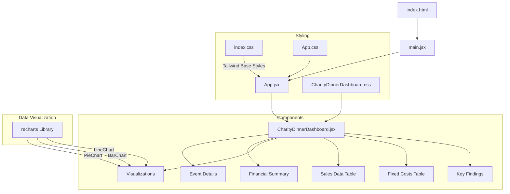

# Charity Dinner Dashboard

A comprehensive React-based dashboard for visualizing and analyzing charity dinner event data, including financial metrics, sales data, and performance visualizations.

## Project Architecture



## How This Project Works

### Modern React Component Architecture

This dashboard uses a **modular component architecture**, which is like building with specialized LEGO blocks. Each chart and visualization is its own separate component:

1. **Main Dashboard Component**: `CharityDinnerDashboard.jsx` is the "parent" component that:
    
    - Contains all the data
    - Calculates derived values
    - Imports and arranges all the smaller components
2. **Chart Components**: Each type of chart is its own separate component:
    
    - `WaterfallChart.jsx`: Shows the flow of money (revenue, costs, profit)
    - `RevenueStructureChart.jsx`: Shows revenue sources as a pie chart
    - `CategorySalesChart.jsx`: Displays sales performance by category
    - `FixedCostsChart.jsx`: Breaks down the fixed costs

This modular approach has several advantages:

- **Easier to maintain**: If a chart needs fixing, you only edit one small file
- **Reusability**: Charts can be reused in different parts of the app
- **Team collaboration**: Different team members can work on different components

### Data Flow in Modern React

Data flows in a one-way direction, from parent to child components:

1. **Source Data**: The main data lives in `CharityDinnerDashboard.jsx`:
    
    ```jsx
    // Example of source data in CharityDinnerDashboard.jsx
    const eventDetails = {
      venue: "Co-Op Live Stadium",
      capacity: 25000,
      ticketPrice: 25,
      // more data...
    };
    ```
    
2. **Props Passing**: Data is passed down to child components:
    
    ```jsx
    <WaterfallChart 
      entranceFeeRevenue={entranceFeeRevenue} 
      salesProfit={salesProfit} 
      fixedCostsTotal={fixedCostsTotal} 
      netProfit={netProfit} 
    />
    ```
    
3. **Component Usage**: Child components receive and use the data:
    
    ```jsx
    // Inside WaterfallChart.jsx
    const WaterfallChart = ({ entranceFeeRevenue, salesProfit, fixedCostsTotal, netProfit }) => {
      // Use the data to create a chart
    }
    ```
    

### Performance Optimization with React Hooks

This dashboard uses modern React hooks for better performance:

#### The useMemo Hook

```jsx
// This code from CharityDinnerDashboard.jsx demonstrates useMemo
const {
  processedSalesData,
  salesProfit,
  // more variables...
} = useMemo(() => {
  // Complex calculations only run when dependencies change
  // Process sales data
  const processed = salesTableData.map(item => {
    // calculations...
  });
  
  // More calculations...
  
  return {
    processedSalesData: processedWithPercentages,
    salesProfit: totalSalesProfit,
    // more return values...
  };
}, [salesTableData, fixedCostsTableData, eventDetails]);
```

**What this does in simple terms**:

- It's like a smart calculator that remembers its answers
- It only recalculates when the input data changes
- This makes the dashboard much faster because it doesn't repeat work unnecessarily

### Recharts Data Visualization

The project uses Recharts, a charting library specifically designed for React:

```jsx
// Example from RevenueStructureChart.jsx
<PieChart>
  <Pie
    data={dataWithPercentages}
    cx="50%"
    cy="50%"
    innerRadius={60}
    outerRadius={80}
    fill="#8884d8"
    paddingAngle={5}
    dataKey="value"
    label={({ name, percentage }) => `${name}: ${percentage}`}
  >
    {dataWithPercentages.map((entry, index) => (
      <Cell key={`cell-${index}`} fill={COLORS[index % COLORS.length]} />
    ))}
  </Pie>
  <Tooltip formatter={(value) => `£${value.toLocaleString()}`} />
</PieChart>
```

**Benefits for beginners**:

- Declarative approach: You describe what you want, not how to draw it
- React integration: Works seamlessly with React's component model
- Responsive by default: Charts adjust to screen size automatically

### CSS and Styling Approach

The project uses both Tailwind CSS and custom CSS:

1. **Tailwind CSS**: Utility classes directly in the HTML:
    
    ```jsx
    <div className="min-h-screen bg-gray-100">
    ```
    
2. **Custom CSS**: More complex styles in the CSS file:
    
    ```css
    .dashboard-container {
      padding: 2rem;
      max-width: 72rem;
      margin-left: auto;
      margin-right: auto;
      /* more styles... */
    }
    ```
    

This combined approach gives you the best of both worlds:

- Quick styling with Tailwind utility classes
- More complex, reusable styles with custom CSS
- Consistent design system for the entire application

## Architecture Explanation for Beginners

The Charity Dinner Dashboard is built using a modern React application structure with Vite as the build tool. Let's break down what this means:

### What is React?

React is a JavaScript library for building user interfaces. It allows developers to create reusable UI components that can efficiently update when your data changes. Think of it like building with LEGO blocks - you create small, reusable pieces that fit together to form a complete application.

### What is Vite?

Vite (French for "quick") is a build tool that significantly speeds up development. Unlike older tools like Create React App, Vite provides much faster startup and hot module replacement, meaning you see your changes almost instantly when developing.

### Entry Point and Component Hierarchy

1. **index.html**: This is the single HTML file that loads in the browser. It contains a div with an id of "root" where our React application will be mounted.
    
2. **main.jsx**: This is the JavaScript entry point that:
    
    - Imports React and ReactDOM
    - Finds the "root" element in our HTML
    - Renders our main App component inside it
3. **App.jsx**: This is our main container component that:
    
    - Sets up the overall page layout
    - Imports and displays the CharityDinnerDashboard component
4. **CharityDinnerDashboard.jsx**: This is the core dashboard component that:
    
    - Contains all the data and business logic
    - Renders all the visualizations and tables
    - Handles the layout of the dashboard sections

### Dashboard Components Explained

The CharityDinnerDashboard is divided into several logical sections:

- **Event Details**: Shows key information about the charity dinner event in card format (venue, capacity, ticket price, etc.).
- **Financial Summary**: Displays the overall financial metrics with color-coded cards (green for profit, red for costs).
- **Visualizations**: Contains interactive charts that visually represent the data for easier understanding.
- **Sales Data Table**: Shows detailed sales information in a structured table format.
- **Fixed Costs Table**: Lists all fixed costs associated with the event in a clear table.
- **Key Findings**: Highlights important insights derived from the data analysis in a bulleted list.

### Styling Approach Explained

The project uses a combination of two styling methods:

- **Tailwind CSS**: A utility-first CSS framework that lets you build designs directly in your HTML by applying pre-defined classes. For example, instead of writing `margin-top: 20px` in a CSS file, you simply add the class `mt-5` to your HTML element.
    
- **Custom CSS**: For more complex styling needs, we use traditional CSS in the CharityDinnerDashboard.css file. This gives us more control over specific styling requirements that would be cumbersome to implement with utility classes alone.
    

### Data Visualization Explained

The dashboard uses the Recharts library to create interactive charts:

- **Pie Charts**: Circular charts divided into segments, perfect for showing how different parts contribute to a whole (like how different items contribute to total profit).
- **Bar Charts**: Rectangular bars that make it easy to compare values across different categories.
- **Responsive Containers**: Special wrappers that ensure charts look good on all screen sizes, from mobile phones to large desktop monitors.

## Detailed Step-by-Step Project Creation Guide

This guide assumes you're completely new to Node.js and React development. We'll walk through each step in detail.

### 0. Prerequisites Installation

Before starting, you need to install Node.js and npm (Node Package Manager).

#### What is Node.js?

Node.js is a JavaScript runtime that allows you to run JavaScript code outside of a web browser. It's essential for modern web development.

#### What is npm?

npm (Node Package Manager) comes with Node.js and allows you to install and manage packages (reusable code) from the npm registry.

#### Installation Steps:

1. **Download Node.js**: Visit [nodejs.org](https://nodejs.org/) and download the LTS (Long Term Support) version.
2. **Run the installer**: Follow the installation wizard. The default settings are usually fine.
3. **Verify installation**: Open a terminal or command prompt and run:
    
    ```bash
    node --versionnpm --version
    ```
    
    You should see version numbers displayed, confirming successful installation.

### 1. Project Setup Explained

```bash
# Create a new Vite project with React template
npm create vite@latest charity-dashboard -- --template react
```

**What this does**: This command creates a new project folder called "charity-dashboard" with a basic React application structure using Vite as the build tool. The `--template react` flag specifies that we want a React project.

**Expected output**: You'll see messages about the project being created, and instructions to navigate to the project directory and install dependencies.

```bash
# Navigate to the project directory
cd charity-dashboard
```

**What this does**: Changes your current directory to the newly created project folder.

```bash
# Install dependencies
npm install
```

**What this does**: Reads the package.json file (which lists all the packages your project needs) and downloads them into a folder called "node_modules". This might take a minute or two.

**Expected output**: You'll see a progress bar and then a summary of installed packages.

#### Understanding the Generated Files:

- **package.json**: The project's configuration file that lists dependencies, scripts, and other metadata.
- **node_modules/**: A folder containing all the installed packages (this folder is large and should never be committed to version control).
- **public/**: Contains static assets that will be served as-is.
- **src/**: Contains your source code.
    - **main.jsx**: The entry point of your application.
    - **App.jsx**: The main component.
    - **index.css**: Global styles.

### 2. Adding Required Libraries Explained

```bash
# Install Recharts for data visualization
npm install recharts
```

**What this does**: Installs the Recharts library, which provides React components for creating charts and graphs.

**Why Recharts?**: We chose Recharts because it's:

- Built specifically for React
- Easy to use with declarative components
- Highly customizable
- Responsive by default

```bash
# Install Tailwind CSS and its dependencies
npm install -D tailwindcss postcss autoprefixer
```

**What this does**: Installs Tailwind CSS and its required tools as development dependencies (-D flag).

- **tailwindcss**: The core Tailwind library
- **postcss**: A tool for transforming CSS with JavaScript
- **autoprefixer**: Automatically adds vendor prefixes to CSS for better browser compatibility

**Why Tailwind CSS?**: We chose Tailwind because it:

- Speeds up development by using utility classes
- Provides a consistent design system
- Reduces the need for custom CSS
- Makes responsive design easier

```bash
npx tailwindcss init -p
```

**What this does**: Initializes Tailwind CSS by creating two configuration files:

- **tailwind.config.js**: Configuration for Tailwind
- **postcss.config.js**: Configuration for PostCSS

**What is npx?**: npx is a tool that comes with npm and allows you to run packages without installing them globally.

### 3. Configuring Tailwind CSS Explained

**tailwind.config.js**:

```javascript
/** @type {import('tailwindcss').Config} */
export default {
  content: [
    "./index.html",
    "./src/**/*.{js,ts,jsx,tsx}",
  ],
  theme: {
    extend: {},
  },
  plugins: [],
}
```

**What this does**:

- **content**: Tells Tailwind which files to scan for class names. This ensures only the CSS for classes you actually use gets included in the final build.
- **theme**: Allows you to customize colors, spacing, breakpoints, etc.
- **plugins**: Allows you to add additional Tailwind plugins if needed.

**src/index.css**:

```css
@tailwind base;
@tailwind components;
@tailwind utilities;
```

**What this does**: These three directives import Tailwind's:

- **base**: Reset styles and basic HTML element styles
- **components**: Component class definitions
- **utilities**: Utility class definitions

This file will be processed by PostCSS to generate the actual CSS used by your application.

### 4. Creating the Component Structure Explained

#### 1. Setting up App.jsx

```jsx
import React from 'react'
import CharityDinnerDashboard from './components/CharityDinnerDashboard'
import './App.css'

function App() {
  return (
    <div className="min-h-screen bg-gray-100">
      <CharityDinnerDashboard />
    </div>
  )
}

export default App
```

**What this code does**:

- **import React**: Brings in the React library
- **import CharityDinnerDashboard**: Imports our custom dashboard component
- **import './App.css'**: Imports any App-specific styles
- **function App()**: Defines a functional component called App
- **return (...)**: Specifies what HTML should be rendered
- **className="min-h-screen bg-gray-100"**: Tailwind classes that:
    - `min-h-screen`: Make the div at least as tall as the viewport
    - `bg-gray-100`: Give it a light gray background
- **export default App**: Makes the App component available for import in other files

#### 2. Creating the CharityDinnerDashboard Component

For this component, we need to create two files:

- **src/components/CharityDinnerDashboard.jsx**: The component code
- **src/components/CharityDinnerDashboard.css**: Component-specific styles

**First, create the components directory**:

```bash
mkdir -p src/components
```

**What this does**: Creates a new directory called "components" inside the "src" directory. The `-p` flag creates parent directories if they don't exist.

**Then create the component files**:

The CharityDinnerDashboard.jsx file is quite large, but it's structured into several sections:

1. **Imports**: Bringing in React, Recharts components, and CSS
2. **Component Definition**: Creating a functional component
3. **Data Definition**: Setting up the data for the dashboard
4. **Return Statement**: Defining the JSX structure of the dashboard
    - Dashboard header
    - Event details section
    - Financial summary section
    - Visualizations (charts)
    - Data tables
    - Key findings section

#### 3. Implementing Data Visualization with Recharts

Recharts makes it easy to create charts in React. Here's how we implement a pie chart:

```jsx
<ResponsiveContainer width="100%" height={300}>
  <PieChart>
    <Pie
      data={salesData}
      cx="50%"
      cy="50%"
      labelLine={false}
      label={({ name, percent }) => `${name}: ${(percent * 100).toFixed(1)}%`}
      outerRadius={100}
      innerRadius={60}
      fill="#8884d8"
      dataKey="profit"
      nameKey="category"
      paddingAngle={2}
    >
      {salesData.map((entry) => (
        <Cell key={`cell-${entry.category}`} fill={entry.color} />
      ))}
    </Pie>
    <Tooltip formatter={(value) => `£${value.toLocaleString()}`} />
    <Legend layout="vertical" verticalAlign="middle" align="right" />
  </PieChart>
</ResponsiveContainer>
```

**What this code does**:

- **ResponsiveContainer**: Ensures the chart resizes with its container
- **PieChart**: The main chart component
- **Pie**: Defines a pie chart with specific properties:
    - `data`: The array of data to display
    - `cx` and `cy`: Center position (50% means centered)
    - `labelLine`: Whether to show lines to labels
    - `label`: Custom label format
    - `outerRadius` and `innerRadius`: Size of the pie (innerRadius creates a donut chart)
    - `dataKey`: Which property of the data objects to use for the pie segments
    - `nameKey`: Which property to use for segment names
- **Cell**: Individual segments with custom colors
- **Tooltip**: Shows details when hovering over segments
- **Legend**: Shows a legend explaining the chart

#### 4. Styling the Components

We use a combination of Tailwind utility classes and custom CSS:

**Tailwind Example**:

```jsx
<div className="min-h-screen bg-gray-100">
```

**Custom CSS Example** (in CharityDinnerDashboard.css):

```css
.dashboard-container {
  padding: 2rem;
  max-width: 72rem;
  margin-left: auto;
  margin-right: auto;
  background-color: white;
  border-radius: 0.75rem;
  box-shadow: 0 10px 25px -5px rgba(0, 0, 0, 0.1), 0 10px 10px -5px rgba(0, 0, 0, 0.04);
  font-family: 'Inter', -apple-system, BlinkMacSystemFont, 'Segoe UI', Roboto, sans-serif;
}
```

**Why this approach?**:

- Tailwind is great for quick, consistent styling
- Custom CSS is better for complex, reusable styles
- This combination gives us the best of both worlds

### 5. Data Management Explained

For this project, we use hardcoded data within the component:

```jsx
// Event details directly from the data
const eventDetails = {
  venue: "Co-Op Live Stadium",
  capacity: 25000,
  ticketPrice: "£25",
  predictedRevenue: "£625,000",
  duration: "4 Hours"
};

// Sales data directly from the table
const salesData = [
  { category: "Snack", stock: 1000, sold:; 1000, costPrice: 1, sellingPrice: 2, profit: 1000, percentProfit: "8.1%", color: "#3b82f6" },
  // More data...
];
```

**What this does**:

- Creates JavaScript objects and arrays to store our data
- Makes it easy to reference this data in our JSX
- Allows us to calculate derived values (like total profit)

**Why hardcode data?**:

- Simplifies the initial development
- Allows us to focus on the UI without worrying about data fetching
- Makes the project self-contained

**In a real application**:

- Data would typically come from an API or database
- You would use React's `useState` and `useEffect` hooks to fetch and store data
- You might use a state management library like Redux for more complex data needs

## Running the Project

### Prerequisites Explained

- **Node.js**: The JavaScript runtime that powers our development environment
- **npm**: The package manager that installs and manages our dependencies

### Installation Explained

1. **Clone the repository**:
    
    ```bash
    git clone <repository-url>
    cd charity-dashboard
    ```
    
    **What this does**:
    
    - `git clone`: Downloads the project code from a Git repository
    - `cd charity-dashboard`: Navigates into the project directory
    
    **If you don't have Git**:
    
    - You can download the project as a ZIP file from the repository website
    - Extract the ZIP file and navigate to the folder in your terminal
2. **Install dependencies**:
    
    ```bash
    npm install
    ```
    
    **What this does**:
    
    - Reads the package.json file to determine what packages are needed
    - Downloads all required packages into the node_modules folder
    - Creates or updates package-lock.json, which locks the exact versions of dependencies
    
    **Common issues**:
    
    - If you see permission errors, you might need to run as administrator or use `sudo`
    - If you see network errors, check your internet connection
    - If you see compatibility errors, make sure your Node.js version matches the requirements

### Development Server Explained

```bash
npm run dev
```

**What this does**:

- Starts the Vite development server
- Compiles your React code
- Serves your application, typically at http://localhost:5173/
- Enables hot module replacement (changes appear instantly without full refresh)

**What you'll see**:

- Terminal output showing the server starting
- A URL where you can view your application
- Any errors or warnings in your code

**How to use it**:

- Keep this terminal running while you develop
- Open the URL in your browser to see your application
- Make changes to your code and they'll appear automatically
- Press Ctrl+C in the terminal to stop the server when you're done

### Building for Production Explained

```bash
npm run build
```

**What this does**:

- Compiles your code for production (minifies, optimizes, etc.)
- Creates a `dist` directory with the compiled files
- Generates HTML, CSS, and JavaScript files that can be deployed to a web server

**What you'll see**:

- Terminal output showing the build progress
- Information about the generated files and their sizes
- Any errors or warnings that need to be addressed

### Preview Production Build Explained

```bash
npm run preview
```

**What this does**:

- Serves your production build locally
- Allows you to test the production version before deploying
- Typically runs on a different port than the development server

**Why this is useful**:

- The development server and production build can behave differently
- This lets you catch any issues that might only appear in production
- It's a good final check before deploying to a live server

## Design Choices Explained

### Why React?

We chose React for this dashboard because:

- **Component-Based**: React's component architecture makes it easy to break down complex UIs into manageable pieces
- **Virtual DOM**: React's virtual DOM provides excellent performance for data-heavy applications like dashboards
- **Ecosystem**: React has a vast ecosystem of libraries and tools, including Recharts for data visualization
- **Developer Experience**: React's developer tools and hot reloading make development faster and more enjoyable

### Why Vite?

We chose Vite as our build tool because:

- **Speed**: Vite is significantly faster than older tools like Create React App
- **Modern**: Vite is built on modern JavaScript features and doesn't require as much transpilation
- **Hot Module Replacement**: Changes appear instantly during development
- **Optimized Production Builds**: Vite creates highly optimized builds for production

### Why Tailwind CSS?

We chose Tailwind CSS for styling because:

- **Productivity**: Tailwind's utility classes allow for rapid UI development
- **Consistency**: Tailwind provides a design system with consistent spacing, colors, etc.
- **Responsive Design**: Tailwind makes it easy to create responsive layouts
- **Customization**: Tailwind can be customized to match any design requirements

### Why Recharts?

We chose Recharts for data visualization because:

- **React Integration**: Recharts is built specifically for React
- **Declarative API**: Recharts has a simple, declarative API that fits well with React's philosophy
- **Customization**: Recharts charts can be extensively customized
- **Responsiveness**: Recharts charts are responsive by default

## Future Enhancements

Potential improvements for the dashboard:

1. **Dynamic Data Loading**: Implement API integration to fetch real-time data.
2. **User Authentication**: Add login functionality for authorized access.
3. **Interactive Filters**: Allow users to filter data by date range or categories.
4. **Export Functionality**: Enable exporting reports as PDF or Excel files.
5. **Dark Mode**: Implement a theme toggle for better user experience.

## Troubleshooting Common Issues

### Installation Problems

- **Error: ENOENT no such file or directory**: Make sure you're in the correct directory
- **Error: EACCES permission denied**: Try running with sudo (on Mac/Linux) or as administrator (on Windows)
- **Error: npm ERR! code ENETUNREACH**: Check your internet connection

### Development Server Issues

- **Error: Port 5173 is already in use**: Another process is using the port. Either close that process or change the port in vite.config.js
- **White screen with no errors**: Check your browser console for errors
- **Changes not appearing**: Make sure you saved the file and the development server is running

### Build Problems

- **Error: Build failed with errors**: Check the error messages for specific issues
- **Warning: Large bundle size**: Consider code splitting or removing unused dependencies
- **CSS not applying correctly**: Make sure your CSS is being imported properly